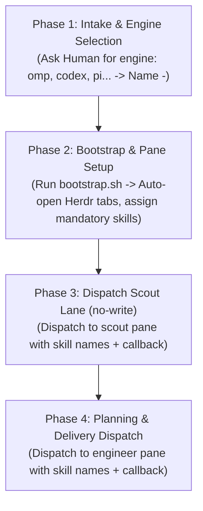

# SLP PROJECT KICKOFF PLAYBOOK
> Field handbook for starting a new project under the Supervisor – Lead – Peer (SLP) doctrine in Herdr

---

## 1. OVERVIEW & IMMUTABLE PRINCIPLES

> ⛔ **FORBIDDEN #1 (ANTI-SOLO INVARIANT):**
> **Lead MUST NEVER impersonate a Peer to write code, write deliverable docs, or generate `NNN-answer-*.md` files in the same session.**
> Every Assignment Envelope must be dispatched to an **independent agent process/pane** (via `bash .agents/skills/slp-collab/scripts/slp-send.sh`).
> Lead must not use sleep/timeout loops to wait. Send the command with callback instructions and wait for the Peer to report back!



---

## 2. PHASE 1: INTAKE & ENGINE SELECTION

### 2.1 Receive the Spec (PDR / Spec)
- Place product requirements in `spec/` (e.g. `spec/PDR-carplay-ios.md`).

### 2.2 Write a One-Sentence Problem Statement (REQUIRED)
Lead and Human agree on a single sentence defining the project:
```text
"For [user/system], achieve [observable result] within [technical boundary/scope], because [core impact/value], without [excluded behaviors/features].
```

### 2.3 Ask Human for Agent Engine Selection & `<role>-<agent>` Naming
Lead asks Human proactively: *"Which engine do you want for each role? (e.g. omp, codex, pi, opencode2, claude, agy...)"*.

Standard naming rule: `<role>-<agent>`:
- `scout-omp` or `scout-codex`: Research and survey specialists (`no-write`).
- `engineer-codex` or `engineer-pi`: Code and unit-test specialists (`write-bounded`).
- `reviewer-pi` or `reviewer-claude`: Security and contract audit specialists (`no-write`).
- `designer-omp`: Wireframe and flow design specialist (`no-write`).

---

## 3. PHASE 2: INFRASTRUCTURE BOOTSTRAP & AUTOMATIC HERDR TAB SETUP

### 3.1 Initialize Infrastructure & Open Tabs
```bash
# Fresh start: auto-create the herdr-context/ tree, open Herdr tabs, assign 4 mandatory skills:
bash .agents/skills/slp-init/scripts/bootstrap.sh scout-omp engineer-codex reviewer-pi

# Or, to reopen an existing project, run with no arguments to auto-restore:
bash .agents/skills/slp-init/scripts/bootstrap.sh
```

---

## 4. PHASE 3: ARCHITECTURE SURVEY (SCOUT LANE: NO-WRITE)

### 4.1 Write Assignment Envelope 001
Lead writes `herdr-context/scout-<agent>/001-request-YYYY-MM-DD-architecture-baseline.md`.
**Must contain:**
```markdown
## Mandatory Skills
`slp-peer`, `slp-peer-knowledge`, `slp-state`, `slp-collab`
```

### 4.2 Dispatch via `bash .agents/skills/slp-collab/scripts/slp-send.sh` (Skill Names & Callback)
Lead sends the task to the Scout pane and yields control (no polling):
```bash

bash .agents/skills/slp-collab/scripts/slp-send.sh scout-omp "Skills: [slp-peer, slp-peer-knowledge, slp-state, slp-collab]. Read herdr-context/scout-omp/001-request-*.md, follow it. Load COMMON-BASELINE + your role baseline per slp-peer-knowledge. Once done, update _state/MEMORY.md, update status.json, refresh context-compact.md, and reply: bash .agents/skills/slp-collab/scripts/slp-send.sh Lead \"[DONE] scout-omp: herdr-context/scout-omp/001-answer-2026-08-28-architecture-baseline.md — CONFIRM\""
```

### 4.3 Reconcile & Create Decision Record 001
When `scout-omp` runs the callback reporting `[DONE]` to the Lead pane, Lead reads the `001-answer-*.md` file, reviews it, and saves the decision at `herdr-context/_decisions/001-architecture-baseline.md`.

---

## 5. PHASE 4: PLAN & DISPATCH THE DELIVERY LANE

### 5.1 Dispatch Task 002 to the `engineer-<agent>` Pane
```bash

bash .agents/skills/slp-collab/scripts/slp-send.sh engineer-codex "Skills: [slp-peer, slp-peer-knowledge, slp-state, slp-collab]. Read herdr-context/engineer-codex/002-request-*.md, follow it. Load COMMON-BASELINE + your role baseline per slp-peer-knowledge. Once done, update _state/MEMORY.md, update status.json, refresh context-compact.md, and reply: bash .agents/skills/slp-collab/scripts/slp-send.sh Lead \"[DONE] engineer-codex: herdr-context/engineer-codex/002-answer-2026-08-28-deliverables.md — CONFIRM\""
```

### 5.2 Activate Supervisor Monitoring
The Supervisor watches `_attention/` and flags any agent going solo, skipping mandatory skills, or looping on errors.
