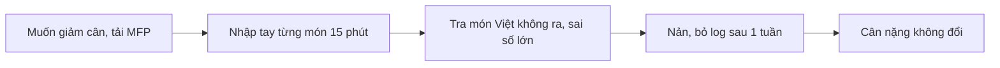
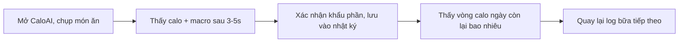
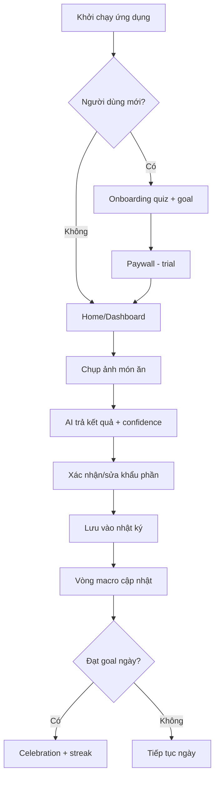
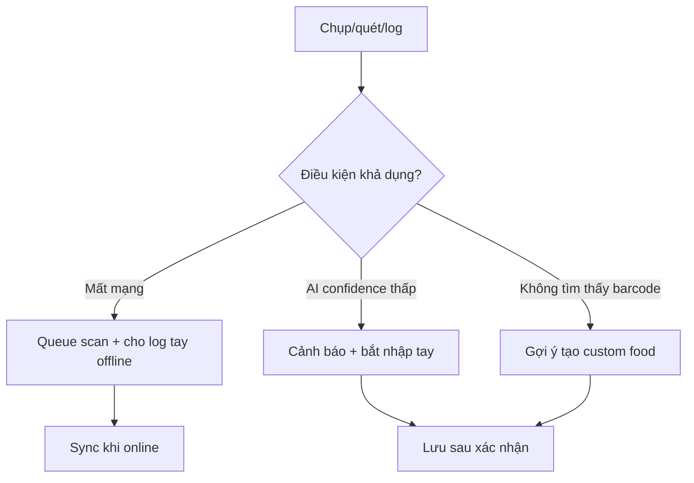
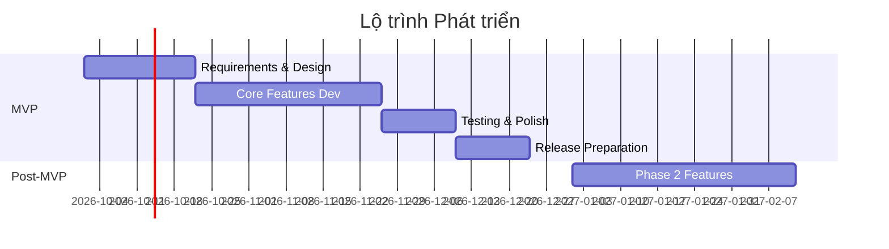

# CaloAI - Tài liệu Yêu cầu Sản phẩm

**Version**: 1.0
**Date**: 2026-09-28
**Author**: AI Research Agent
**Mode**: Full PRD
**Status**: Bản nháp để PO rà soát

## Các bên liên quan

| Vai trò | Tên | Trách nhiệm | Liên kết |
|---|---|---|---|
| Project Manager | (chưa chỉ định — PO chốt) | Quản lý toàn bộ dự án, quyết định cuối cùng |  |
| Product Owner | (chưa chỉ định — PO chốt) | Nghiên cứu phân tích dự án, chốt các tính năng và các phase phát triển dự án |  |
| Developer | iOS Team | Triển khai code xây dựng dự án (SwiftUI, SwiftData, HealthKit, StoreKit 2) |  |
| UI/UX | Design Team | Thiết kế dự án |  |
| Data Analytic | Data Team | Viết tài liệu tracking và tracking số liệu hằng tuần |  |
| BE | Backend Team | Viết API để ứng dụng lấy dữ liệu (Supabase + Edge Functions) |  |
| AI | AI Team | Tạo các model AI xử lý tính năng trong app (food vision pipeline, prompt/RAG món Việt) |  |
| Graphic | Graphic Team | Thiết kế icon và screenshot cho app |  |
| ASO | ASO Team | Tạo tên app, description, keyword, localization và các thông tin giới thiệu về app trên Store |  |
| Tester | QA Team | Kiểm tra app, đảm bảo chất lượng app trước khi lên store |  |
| Marketing (UA) | UA Team | Kinh doanh sản phẩm (TikTok/IG fitness influencer) |  |

## Lịch sử phiên bản

| Ngày | Phiên bản | Nội dung | Tác giả |
|---|---|---|---|
| 2026-09-28 | 1.0 | Tạo bản nháp PRD đầu tiên cho CaloAI | AI Research Agent |

## Liên kết quan trọng

| Nội dung | Liên kết |
|---|---|
| UI/UX | www.figma.com (Design cập nhật khi có file) |
| Diagram | (xem kiến trúc ở Overview §3) |
| Api | Supabase project URL + Edge Functions (BE cấp khi kickoff) |
| Monet | StoreKit 2 products: caloai_pro_monthly, caloai_pro_yearly (tạo trên App Store Connect khi kickoff) |

---

## 1. Tóm tắt Điều hành

### Phát biểu Vấn đề
Người muốn kiểm soát cân nặng (giảm cân, tăng cơ, ăn keto/IF) bỏ cuộc với nhật ký calo thủ công: nhập tay mỗi bữa mất 10–15 phút, database món Việt thiếu và sai số lớn, không biết mình còn được ăn bao nhiêu trong ngày. Các app hiện tại (MyFitnessPal, Yazio) mạnh về database đồ Tây nhưng ma sát logging cao, giá cao, không có AI chụp ảnh thực sự nhanh. Kết quả: D1 retention thấp, người dùng quay lại ăn uống mất kiểm soát sau 1–2 tuần.

### Giải pháp
CaloAI là app iOS theo dõi calo bằng AI: chụp ảnh món ăn → trả calo + protein/carb/fat trong ~3–5 giây, kèm nhật ký ngày, vòng macro, cân nặng, đồng bộ Apple Health. Giá trị cốt lõi: **log 1 bữa dưới 10 giây** (chụp → xác nhận → xong), database món Việt có kiểm duyệt, human-in-the-loop bắt buộc (user xác nhận khẩu phần trước khi lưu). Không hứa hẹn "AI đo gram tuyệt đối chính xác" — hiển thị confidence và khoảng sai số.

### Tại sao là lúc này
- Multimodal LLM (Gemini 2.5 Flash / GPT-4o-mini class) đủ rẻ và nhanh để ước lượng món hỗn hợp từ ảnh (~2–4s, chi phí thấp/scan) — điều 2023 trở về trước chưa khả thi ở giá tiêu dùng.
- Cal AI (calai.app, launch 5/2024) đã chứng minh wedge "snap-to-log" là nhu cầu thật: ~5M+ users (founder-stated, ước tính), 4.7–4.9★ hàng trăm nghìn reviews — nhưng dính sự cố billing (Apple gỡ tạm 4/2026) và breach Firebase 3/2026 → khoảng trống cho bản làm đúng compliance + bảo mật.
- Hành vi acquire qua fitness influencer TikTok/IG đã thành playbook rẻ cho nhóm 18–35.

### Thị trường Mục tiêu
- **Primary Users**: 18–35 tuổi, bận rộn, đã từng bỏ MyFitnessPal vì nhập tay mệt; mục tiêu giảm cân (deficit) là chính, tăng cơ/keto/IF là phụ. Thị trường đầu: Việt Nam + mở rộng US/EU (nơi Cal AI đã educate thị trường).
- **Positioning**: "Chụp 1 tấm là biết calo" — app log calo nhanh nhất, rẻ hơn MyFitnessPal ~2.5x ở gói năm, món Việt chuẩn.
- **Market Size Framing**: Phân khúc diet/nutrition tracking là thị trường toàn cầu có sẵn hàng chục triệu người dùng (MyFitnessPal, Yazio, Lifesum quy mô 1M+ downloads trở lên); Cal AI chứng minh sub-segment AI-photo là nhu cầu thật với hàng triệu users trong ~2 năm.
- **Market Trend**: Đang tăng trưởng (AI-photo logging mới nổi, fasting/keto/high-protein là xu hướng ăn uống bền vững).

### Tiêu chí Thành công
- Activation: ≥60% user mới hoàn thành onboarding → log bữa đầu trong 24h.
- Retention: D1 ≥30%, D7 ≥15%, D30 ≥8% ở cohort MVP (ngưỡng PMF ban đầu).
- Monetization: trial-to-paid ≥8%, gói năm chiếm ≥50% paid subs.
- Chỉ mở rộng scope (meal plan AI, Watch, social) sau khi retention + trial-to-paid đạt ngưỡng trên.

---

## 2. Mục tiêu và Bối cảnh

### Mục tiêu Sản phẩm
Trong 6 tháng, CaloAI thắng ở đúng 1 điều: **trở thành cách log calo ít ma sát nhất cho người Việt 18–35** (chụp → xác nhận → xong dưới 10 giây, món Việt chuẩn ±20% sau xác nhận), với giá năm rẻ nhất phân khúc AI-photo, trước khi mở rộng sang coaching/meal-plan.

### Liên kết với Mục tiêu Kinh doanh
- Tăng trưởng: activation bằng onboarding→goal engine + bữa log đầu trong 24h; retention bằng streaks, nhắc bữa, widget.
- Doanh thu: freemium + subscription (AI scan unlimited là paywall chính); gói năm là value pick.
- Giả định kinh doanh kiểm chứng qua MVP: (1) user trả tiền cho AI scan nhanh hơn nhập tay; (2) willingness-to-pay nằm ở phân khúc ~$29.99/năm; (3) món Việt chuẩn là lý do chuyển từ MFP sang.
- Mốc kinh doanh MVP cần hỗ trợ: trial-to-paid, D30 retention, rating ≥4.6.

### Nguyên tắc Sản phẩm
1. Tốc độ trên độ phủ: 1 flow chụp→log hoàn hảo trước khi thêm tính năng mới.
2. Trung thực về AI: luôn hiển thị confidence + cho sửa grams; không fake chính xác tuyệt đối.
3. Món Việt là công dân hạng nhất: mọi food DB, prompt, serving mặc định phải đúng món Việt trước món Tây.
4. Billing minh bạch tuyệt đối: giá bill thực tế hiển thị to, trial/hủy rõ ràng theo Apple guideline (bài học từ vụ Cal AI 4/2026).
5. Privacy by design: ảnh qua Edge Function, không log PII; dữ liệu HealthKit không upload raw.

---

## 3. Vấn đề Người dùng và Đối tượng Mục tiêu

### Persona Chính
- **Profile**: Nữ/nam 22–32, văn phòng, muốn giảm 3–8kg; đã tải MyFitnessPal 1–2 lần rồi bỏ.
- **Context**: Ăn cơm văn phòng, cơm tấm/phở/bánh mì; tối về lười nhập tay; cân nặng chững.
- **Pain Points**:
  - Nhập tay 1 bữa mất 10–15 phút, tra món Việt không ra hoặc sai số lớn.
  - Không biết "hôm nay còn được ăn bao nhiêu" — thiếu vòng calo/macro trực quan.
  - Paywall các app ngoại đắt ($60–80/năm) mà vẫn phải nhập tay.
- **Need**: Biết calo bữa vừa ăn trong 10 giây và biết cả ngày còn lại bao nhiêu.

### Persona Thứ cấp
- **Profile**: Nam 20–30 tập gym, mục tiêu tăng cơ (đủ protein 140–180g/ngày).
- **Context**: Ăn 3–4 bữa + whey; cần track protein nhanh sau mỗi bữa.
- **Pain Points**:
  - App hiện tại không ước lượng protein món Việt (cơm + thịt + trứng) nhanh.
  - Đồng bộ cân nặng/workout với Apple Health rời rạc.
- **Need**: Log protein mỗi bữa <10s, thấy tiến độ protein/ngày và cân nặng theo tuần.

### Persona Thứ ba (nếu có)
- **Profile**: 25–38 theo keto/IF (low-carb, khung ăn 16:8).
- **Context**: Cần track carb + cửa sổ fasting, không cần chi tiết từng micronutrient.
- **Pain Points**:
  - Ít app gộp fasting timer + carb tracking + AI log trong 1 chỗ giá rẻ.
- **Need**: Timer fasting + cảnh báo vượt carb khi log bữa.

### Hành trình Người dùng Hiện tại

### Hành trình Người dùng Mong muốn

---

## 4. Phân tích Cạnh tranh

### Tổng quan Thị trường
Thị trường chia 2 nhóm: (1) incumbent database (MyFitnessPal, Lose It!, Cronometer, Yazio, Lifesum) — mạnh DB đồ Tây, community, nhưng logging thủ công và giá năm $36–80; (2) AI-photo challenger (Cal AI dẫn đầu từ 5/2024) — thắng bằng snap 3s + giá năm ~$29.99, nhưng accuracy món hỗn hợp yếu, billing từng bị Apple gỡ (4/2026), breach dữ liệu (3/2026). Khoảng trống: AI-photo + món Việt chuẩn + billing minh bạch + bảo mật đúng (server verify, không lộ Firebase).

### Ghi chú Phương pháp luận
Số liệu quy mô/tải/revenue dưới đây là **ước tính từ storefront công khai + báo chí công nghệ** (thu thập 2026-09-28), không phải số liệu kiểm toán. Mục đích là so sánh tương đối để ra quyết định scope/pricing, không phải dự báo tài chính chính xác. Mọi con số high-impact gắn nguồn ở Bảng Bằng chứng; chỗ nào không có nguồn ghi rõ (ước tính).

### Ma trận Đối thủ

| App | Tín hiệu quy mô | Đánh giá | Mô hình giá | Điểm mạnh | Điểm yếu / Phàn nàn | Hàm ý cho chúng ta |
|-----|----------------|----------|-------------|-----------|---------------------|--------------------|
| Cal AI (calai.app) | ~5M+ users (founder-stated, ước tính); 1M+ downloads Android; ~329K ratings iOS + ~272K Android | 4.7–4.9★ | Freemium, Pro ~$9.99/mo hoặc ~$29.99/yr, trial 3 ngày | Snap 3s, giá năm rẻ nhất, onboarding quiz→goal tốt | Accuracy món hỗn hợp sai 25–50%; paywall mập mờ từng bị Apple gỡ 4/2026; breach 3.2M records 3/2026; free tier yếu | Clone flow snap nhưng fix billing minh bạch + human confirm + bảo mật server-side |
| MyFitnessPal | Quy mô lớn nhất phân khúc (hàng chục triệu users, ước tính) | ~4.6–4.7★ | Premium ~$19.99/mo hoặc ~$79.99/yr; Premium+ ~$24.99/mo | DB lớn nhất, barcode, community, tích hợp thiết bị | Đắt, nhập tay mệt, quảng cáo/upsell nhiều, AI-photo chỉ một phần | Thắng bằng tốc độ + giá; không đua DB đồ Tây |
| Lose It! | 1M+ downloads (ước tính) | ~4.7★ | Paid ~$39.99/yr (ước tính) | UX sạch, goal tracking tốt | Không có AI-photo mạnh, món châu Á yếu | Học UX diary/macros ring |
| Yazio / Lifesum / Foodvisor | Mỗi app 1M+ downloads (ước tính) | 4.6–4.8★ | ~$35–60/yr tùy app | Meal plan + fasting + barcode (Yazio/Foodvisor có AI-photo) | Giá cao hơn Cal AI, món Việt yếu, plan Tây hóa | Gộp fasting + plan ở P1/P2, nhưng MVP chỉ log |
| Noom | Quy mô lớn, doanh thu cao (ước tính) | ~4.5★ | ~$209/yr (ước tính) | Coaching hành vi, program giảm cân | Đắt gấp 7x, không có AI-photo, nặng nề | Không đua coaching ở MVP; coach AI nhẹ ở P1 |

### Bảng 1. Chỉ số Thị trường & Thương mại

| Chỉ số | Cal AI | MyFitnessPal | Lose It! | Yazio | Lifesum |
|---|---|---|---|---|---|
| Tên app | Cal AI - AI Calorie Tracker | MyFitnessPal | Lose It! | Yazio | Lifesum |
| Link cài app | https://apps.apple.com/app/id6480417616 (Cal AI iOS) | https://apps.apple.com/app/myfitnesspal/id341232718 | https://apps.apple.com/app/lose-it/id297368629 | https://apps.apple.com/app/yazio/id946099227 | https://apps.apple.com/app/lifesum/id286906691 |
| Quy mô tải/người dùng | ~5M+ users; 1M+ Android (ước tính) | Hàng chục triệu (ước tính) | 1M+ (ước tính) | 1M+ (ước tính) | 1M+ (ước tính) |
| Rating | 4.7–4.9★, ~329K iOS + ~272K Android (ước tính tại thời điểm thu thập) | ~4.6–4.7★ | ~4.7★ | ~4.7★ | ~4.6★ |
| DAU | Không công bố (ước tính: phân khúc AI-photo DAU/MAU ~30–40%) | Không công bố | Không công bố | Không công bố | Không công bố |
| IAP revenue | Không công bố | Không công bố | Không công bố | Không công bố | Không công bố |
| RPD | Không công bố | Không công bố | Không công bố | Không công bố | Không công bố |
| Engagement time | Vài phút/ngày, 3–4 sessions (log bữa) (ước tính) | Tương tự (ước tính) | Tương tự (ước tính) | Tương tự (ước tính) | Tương tự (ước tính) |
| Sessions/ngày | 3–4 (theo bữa ăn) (ước tính) | 2–4 (ước tính) | 2–4 (ước tính) | 2–4 (ước tính) | 2–4 (ước tính) |
| Retention D1/D7/D14/D30/D60 | Không công bố; mục tiêu MVP của ta D1≥30/D7≥15/D30≥8 (ASSUMPTION) | Không công bố | Không công bố | Không công bố | Không công bố |
| Mô hình giá | Freemium subscription | Freemium subscription | Freemium subscription | Freemium subscription | Freemium subscription |
| Top country/top countries | US + EU (ước tính) | US + global | US | EU + US | EU + US |

### Bảng 2. Chỉ số Sản phẩm & Kỹ thuật

| Chỉ số | Cal AI | MyFitnessPal | Lose It! | Yazio | Lifesum |
|---|---|---|---|---|---|
| Main features | Photo scan 3s, barcode, text log, diary, macro, weight, fasting, Health sync | Food DB, barcode, diary, community, plans | Diary, goals, barcode, trends | Fasting, meal plan, AI-photo, barcode | Meal plan, fasting, diary |
| App size | ~100–200MB (ước tính) | ~150–250MB (ước tính) | ~100–150MB (ước tính) | ~150–200MB (ước tính) | ~150–200MB (ước tính) |
| Minimum iOS | iOS 16+ (ước tính) | iOS 16+ (ước tính) | iOS 16+ (ước tính) | iOS 16+ (ước tính) | iOS 16+ (ước tính) |
| Version hiện tại | Cập nhật liên tục 2026 (xem storefront) | Cập nhật liên tục 2026 | Cập nhật liên tục 2026 | Cập nhật liên tục 2026 | Cập nhật liên tục 2026 |
| Lần cập nhật gần nhất | 2026 (xem storefront, Collected 2026-09-28) | 2026 | 2026 | 2026 | 2026 |
| Dấu hiệu tuổi đời app | Launch 5/2024 | 2005, lâu đời nhất | 2008 | 2013 | 2013 |

### Phụ lục gọn: IAP, release và ghi chú storefront

| Trường | Cal AI | MyFitnessPal | Lose It! | Yazio | Lifesum |
|---|---|---|---|---|---|
| IAP product names & prices | Pro Weekly ~$2.99, Monthly ~$5.99–9.99, Yearly ~$19.99–49.99 (variant A/B, ước tính); phổ biến $9.99/mo, $29.99/yr | Premium ~$19.99/mo, ~$79.99/yr; Premium+ ~$24.99/mo (ước tính) | Premium ~$39.99/yr (ước tính) | Pro ~$35–60/yr (ước tính) | Premium ~$35–60/yr (ước tính) |
| Ngày phát hành đầu tiên | 5/2024 (Cal AI) | 2005 | 2008 | 2013 | 2013 |
| Ghi chú dữ liệu | Giá A/B theo vùng; trial 3 ngày cần thẻ; storefront US; Collected 2026-09-28 | Giá US storefront; Collected 2026-09-28 | Giá US; Collected 2026-09-28 | Giá EU/US; Collected 2026-09-28 | Giá EU/US; Collected 2026-09-28 |

### Diễn giải nhanh cho chiến lược sản phẩm
- Cal AI thắng nhờ friction thấp nhất + giá thấp nhất — nhưng không nên sao chép toàn bộ: billing mập mờ và bỏ qua human-confirm là lý do mất trust; MVP của ta phải minh bạch giá bill + bắt xác nhận khẩu phần.
- Nhóm AI-photo mới nổi (Cal AI, Foodvisor, Yazio) chứng minh nhu cầu snap-to-log là thật → wedge của ta là snap + món Việt chuẩn, không phải đua DB toàn cầu.
- Willingness-to-pay nằm ở ~$29.99/năm cho AI-photo (rẻ hơn MFP 2.5x); trial ngắn 3–7 ngày + gói năm value pick là công thức đã validate.
- Cơ hội khác biệt rõ nhất: món Việt có kiểm duyệt + confidence/sai số trung thực + HealthKit/Widget iOS làm tới + privacy đúng.
- Kết luận cho PO: MVP chỉ làm log (photo/barcode/text/search) + diary + weight + Health + paywall. Không làm meal-delivery (mảng Calo Trung Đông), social groups, family plan ở MVP.

### Insight Chính từ Review và Định vị của Đối thủ
- **Điều người dùng yêu thích**: Chụp là ra kết quả trong vài giây; onboarding tính goal rõ; vòng macro/diary dễ hiểu; giá năm rẻ.
- **Phàn nàn phổ biến**: AI sai món hỗn hợp/nhà hàng (undercount 25–50%); free tier gần như vô dụng; trial tự gia hạn khó hủy; paywall hiển thị giá mập mờ; lo ngại dữ liệu sức khỏe sau breach.
- **Khoảng trống cơ hội**: Món châu Á/Việt sai số lớn; thiếu confidence + sửa khẩu phần nhanh (ít/vừa/nhiều); thiếu billing minh bạch; thiếu đồng bộ HealthKit 2 chiều mượt.

### Khác biệt hóa của Chúng ta
1. Món Việt hạng nhất: seed 500–800 món có kiểm duyệt dinh dưỡng ở MVP (mở rộng 1500 ở P1), serving mặc định theo suất Việt (tô/chén/dĩa).
2. AI trung thực: mọi kết quả có confidence + khoảng sai số, 3 mức khẩu phần + quick-edit grams, không lưu auto khi confidence thấp.
3. Billing + privacy đúng Apple: giá bill hiển thị to, trial/hủy rõ, verify StoreKit 2 server-side, ảnh qua Edge Function không lộ key, HealthKit không upload raw.

---

## 5. Tầm nhìn và Mục tiêu Sản phẩm

### Tuyên bố Tầm nhìn
CaloAI là cách nhanh nhất để người Việt biết mình vừa ăn bao nhiêu calo — chỉ bằng 1 tấm ảnh.

### Mục tiêu & KPI trong 6 tháng

| Mục tiêu | KPI | Mục tiêu 3 tháng | Mục tiêu 6 tháng | Cách đo lường |
|----------|-----|------------------|------------------|----------------|
| Thu hút người dùng | Installs / activated users | 20K installs, activation ≥55% | 80K installs, activation ≥60% | Analytics (app_opened → onboarding_completed → first_log) |
| Tương tác | DAU/MAU; logs/user/ngày | DAU/MAU ≥25%; ≥2 logs/user/ngày | DAU/MAU ≥32%; ≥2.5 logs/user/ngày | Analytics core events |
| Giữ chân | D1 / D7 / D30 retention | 28% / 13% / 7% | 32% / 16% / 9% | Cohort analytics |
| Kiếm tiền | Trial-to-paid / paid conversion | Trial-to-paid ≥6% | Trial-to-paid ≥8%; gói năm ≥50% paid | Billing + analytics (paywall_viewed → subscription_started) |
| Doanh thu | MRR / paid users | $3K MRR (ASSUMPTION) | $12K MRR (ASSUMPTION) | App Store Connect + backend verify |
| Hài lòng | Rating / NPS | ≥4.5 (≥500 ratings) | ≥4.6 (≥2K ratings) | Store + in-app survey |
| Chất lượng | Crash-free sessions / scan p95 | ≥99.3% / scan <6s | ≥99.5% / scan <5s | Crash reporting + backend latency log |

---

## 6. Phạm vi và Những gì nằm ngoài Phạm vi

### Phạm vi MVP (In Scope)
- Onboarding quiz → goal engine (TDEE, calorie + macro goal) + Sign in with Apple.
- Photo scan log (chụp → AI → xác nhận → lưu) + confirm/edit khẩu phần.
- Barcode scan + text/voice describe + search món Việt + custom food/recipe.
- Daily diary + vòng macro + food detail/edit/delete + relog từ history.
- Water log + exercise/steps (cơ bản) + weight log + trend.
- HealthKit sync 2 chiều (đọc workouts/weight/steps; ghi dietary energy/macros).
- Paywall Pro (monthly/yearly + trial) + restore/cancel guide; push nhắc bữa; widget cơ bản; offline log thủ công + xem history.

### Sau MVP (Giai đoạn tiếp theo)
- P1: VN DB 1500 món + moderation crowdsource, fasting timer, streaks nâng cao, AI coach chat, history/stats sâu, StoreKit 2 hoàn thiện.
- P2: Meal plan AI theo tuần, Apple Watch companion, social/groups, family plan, CloudKit private sync optional.

### Những gì Rõ ràng nằm ngoài Phạm vi MVP
- Meal-delivery/commerce kiểu Calo Trung Đông (nấu + giao món) — mô hình vận hành khác hoàn toàn.
- Social feed/groups công khai, follow bạn bè.
- Family plan, referral phức tạp, đa ngôn ngữ ngoài Việt + Anh.

### Lý do
Giữ MVP hẹp để kiểm chứng đúng 1 giả định sinh tử: user có log bữa 2+ lần/ngày bằng photo trong 7 ngày liên tục và trả tiền cho scan unlimited hay không. Mọi thứ khác (plan, social, Watch) chỉ có ý nghĩa sau khi retention + trial-to-paid đạt ngưỡng.

---

## 7. Yêu cầu và Tính năng

### Bảng Tính năng MVP

| # | Tính năng | User Story | Acceptance Criteria | Ưu tiên |
|---|-----------|------------|---------------------|---------|
| 1 | Onboarding quiz + goal engine | Là người mới, tôi muốn trả lời 6–8 câu hỏi để nhận mục tiêu calo/macro phù hợp | - [ ] Hoàn thành quiz <90s, tính đúng TDEE ±10% với công thức Mifflin-St Jeor - [ ] Hiển thị calorie goal + protein/carb/fat goal + giải thích - [ ] Bỏ qua được, goal mặc định hợp lý | P0 |
| 2 | Photo scan log | Là người ăn, tôi muốn chụp món ăn để biết calo trong vài giây | - [ ] Chụp → kết quả <5s trên 4G (p95) - [ ] Trả items + grams + kcal + P/C/F + confidence - [ ] Confidence <60% thì cảnh báo + bắt xác nhận thủ công | P0 |
| 3 | Xác nhận/sửa kết quả AI | Là người ăn, tôi muốn sửa khẩu phần trước khi lưu để số liệu đúng | - [ ] 3 mức ít/vừa/nhiều + nhập grams tay - [ ] Kcal/macro recalc realtime khi đổi grams - [ ] Không cho lưu khi chưa xác nhận (human-in-the-loop) | P0 |
| 4 | Barcode scan | Là người mua đồ đóng gói, tôi muốn quét mã vạch để log nhanh | - [ ] Quét UPC/EAN <2s, tra DB + fallback Nutritionix/DB nội bộ - [ ] Không tìm thấy → gợi ý tạo custom food | P0 |
| 5 | Text/voice describe log | Là người bận, tôi muốn gõ/nói "2 trứng + 1 chén cơm" để log | - [ ] Parse món + lượng, ước lượng kcal ±20% sau xác nhận - [ ] Hỗ trợ tiếng Việt có dấu/không dấu | P0 |
| 6 | Search món Việt + quick add | Là người Việt, tôi muốn tìm "phở bò" ra ngay suất chuẩn | - [ ] Search <500ms với 500–800 món seed, có kcal/suất + P/C/F - [ ] Recent + favorite + custom foods | P0 |
| 7 | Daily diary + macro ring | Là người dùng, tôi muốn thấy cả ngày còn lại bao nhiêu calo | - [ ] Diary theo bữa sáng/trưa/tối/snack, macro ring realtime - [ ] Hiển thị consumed/remaining/deficit, Health Score | P0 |
| 8 | Weight log + trend | Là người giảm cân, tôi muốn log cân và thấy trend tuần | - [ ] Log cân <10s, chart 7/30/90 ngày, đồng bộ HealthKit | P0 |
| 9 | HealthKit sync | Là người dùng iPhone, tôi muốn đồng bộ workout/steps/cân nặng | - [ ] Xin quyền đúng lúc + usage string rõ; sync 2 chiều dietary - [ ] Background delivery qua observer query | P0 |
| 10 | Paywall Pro + trial | Là người dùng, tôi muốn hiểu rõ giá và dùng thử trước khi trả tiền | - [ ] Giá bill hiển thị to, trial 7 ngày (Default, ASSUMPTION), hủy qua Settings hướng dẫn rõ - [ ] Verify StoreKit 2 server-side, restore hoạt động | P0 |
| 11 | Push nhắc bữa + widget | Là người bận, tôi muốn được nhắc log và xem calo ở widget | - [ ] Nhắc theo timezone, tần suất ≤3/ngày, opt-in rõ - [ ] Widget hiển thị consumed/remaining hôm nay | P1 |
| 12 | Custom food/recipe | Là người nấu ăn, tôi muốn tạo món riêng để log lại nhanh | - [ ] Tạo món/recipe với kcal/100g + serving, dùng lại 1 chạm | P1 |

### Gợi ý khi viết Acceptance Criteria
- Mô tả hành vi observable (thời gian, ngưỡng %, trạng thái), không mô tả implementation nội bộ.
- Ưu tiên điều kiện hoàn thành + trạng thái lỗi + ràng buộc hiệu năng.
- Nếu có entitlement free/premium, viết rõ trong AC (free: 3 scans/ngày — Default ASSUMPTION; Pro: unlimited).

### Sau MVP (Backlog định hướng)
- Fasting timer 16:8 + cảnh báo carb; streaks/gamification; AI coach chat theo lịch sử ăn.
- VN DB 1500 món + crowdsource moderation; history/stats sâu (tuần/tháng, xuất CSV).
- Meal plan AI tuần + grocery list; Apple Watch companion; social/groups (cân nhắc privacy).

---

## 8. Luồng Người dùng

### Luồng Chính: Chụp ảnh → log bữa

### Luồng Phục hồi / Lỗi

### Luồng Phụ
- Barcode → log đồ đóng gói: quét <2s → xác nhận serving → lưu.
- Text/voice → log: gõ/nói → parse → xác nhận → lưu.
- Cân nặng: log cân → chart trend → đồng bộ HealthKit.
- Paywall: xem giá → trial 7 ngày → verify → mở Pro (unlimited scan).

---

## 9. Ràng buộc Sản phẩm và Kỹ thuật

### Ma trận Nền tảng
- **Platform**: iOS (iPhone trước, iPad responsive sau)
- **Minimum Version**: iOS 17.0 (Default, ASSUMPTION — phủ máy VN, dùng SwiftData + Charts)
- **Devices**: iPhone (Portrait chính); iPad/landscape ở P2
- **Orientation**: Portrait (MVP)

### Kiến trúc
- **UI Framework**: SwiftUI 100% (NavigationStack, Charts)
- **Architecture Pattern**: MVVM strict (View → ViewModel @Observable → UseCase/Service → Repository)
- **Dependency Injection**: Manual Factory/Environment (tránh Swinject)
- **Navigation**: NavigationStack + Tab (Home/Scan/Diary/Profile) + sheet/modal cho confirm

### Backend và Dịch vụ
- **Backend**: Supabase (Postgres + Auth + Storage + Edge Functions proxy AI key + verify StoreKit)
- **Authentication**: Sign in with Apple (chính) + Guest (giới hạn); Google ở P1
- **Database**: SwiftData local (source-of-truth offline) + Postgres remote (foods, dishes_vn, meal_logs); pgvector cho food-embedding search (P1)
- **Storage**: Supabase Storage cho ảnh món (nén <1MB, TTL + xóa theo yêu cầu)
- **Analytics**: Firebase Analytics hoặc PostHog (Default: Firebase — ASSUMPTION); Crash: Firebase Crashlytics
- **Crash Reporting**: Crashlytics, mục tiêu crash-free ≥99.5%

### Tích hợp Bên thứ ba
| Dịch vụ | Mục đích | Chi phí |
|---------|----------|---------|
| Gemini 2.5 Flash (primary) / GPT-4o-mini (fallback) | Food vision estimate (JSON items + confidence) | Paid per-scan (ASSUMPTION: cache theo image-hash để giảm cost) |
| Nutritionix / Edamam (fallback) | Barcode + món Tây đóng gói | Freemium/Paid |
| Supabase | API/Auth/Storage/Edge | Freemium → Paid theo scale |

### Mục tiêu Hiệu năng và Độ tin cậy
- **Cold launch**: <1.5s trên iPhone 12
- **Screen-to-content render**: <1.0s với dữ liệu đã cache
- **API p95**: scan chụp→kết quả <5s trên 4G; search <500ms
- **Crash-free sessions**: ≥99.5%

### Offline và Đồng bộ
- **Offline**: đầy đủ cho log tay + xem history (SwiftData local); scan AI queue khi có mạng (BackgroundTask)
- **Sync**: delta sync khi online; SwiftData là source-of-truth
- **Conflict Handling**: last-write-wins theo updated_at + giữ bản local khi mất mạng (Default, ASSUMPTION)

### Thông báo
- Có push (APNs): nhắc log bữa, streak, cân nặng tuần
- Opt-in rõ ràng sau onboarding; mặc định không bật cưỡng bức
- Tần suất ≤3/ngày, theo timezone user
- Không dùng notification để upsell agresif

### Khả năng Trợ năng
- Dynamic Type, VoiceOver cho diary/macro ring/buttons, contrast WCAG AA, vùng chạm ≥44pt
- MVP bắt buộc: VoiceOver đọc được calo/remaining + macro; Dynamic Type không vỡ layout diary

### Quyền riêng tư và Bảo mật
- Thu thập: ảnh món, meal logs, cân nặng, HealthKit (workouts/steps/weight/dietary), email Apple Sign-In
- Mục đích: ước lượng dinh dưỡng + goal/progress; không bán dữ liệu, không upload HealthKit raw
- Consent: ATT nếu chạy ads (MVP không ads); Privacy Manifest + Nutrition Labels; usage string HealthKit/Photos/Camera rõ
- Xóa tài khoản + export dữ liệu trong Settings (bắt buộc App Review); mã hóa TLS + at-rest (Supabase); verify StoreKit server-side chống receipt fraud

### Mức độ Sẵn sàng Phát hành
- Metadata store/keywords/screenshots (VN + EN), privacy policy URL, license food DB (ghi nguồn Viện Dinh dưỡng/USDA)
- QA bắt buộc: scan 50 món Việt phổ biến, paywall/trial/restore, HealthKit accept/deny, offline→sync, review billing minh bạch
- Release-blocker: crash-free <99.3%, scan p95 >6s, paywall không hiển thị giá bill rõ, không có xóa tài khoản

---

## 10. Danh sách Màn hình

| # | Tên màn hình | Mô tả | Ưu tiên | Phụ thuộc |
|---|--------------|-------|---------|-----------|
| 1 | Splash | Khởi động, check session/onboarding | P0 | None |
| 2 | Onboarding quiz | 6–8 câu hỏi lối sống/mục tiêu | P0 | None |
| 3 | Goal result | Hiển thị TDEE + calorie/macro goal | P0 | #2 |
| 4 | Login (Apple/Guest) | Đăng nhập, đồng ý privacy | P0 | #3 |
| 5 | Home/Dashboard | Vòng calo/macro, bữa hôm nay, Health Score | P0 | #4 |
| 6 | Camera scan | Chụp/crop ảnh món ăn | P0 | #5 |
| 7 | AI result confirm | Items + confidence + sửa khẩu phần + lưu | P0 | #6 |
| 8 | Food search | Tìm món Việt + recent/favorite | P0 | #5 |
| 9 | Food detail | Chi tiết món + serving + log | P0 | #8 |
| 10 | Barcode scanner | Quét UPC/EAN + kết quả | P0 | #5 |
| 11 | Text/voice log | Nhập/gõ món + parse + xác nhận | P0 | #5 |
| 12 | Diary | Nhật ký theo bữa + edit/delete/relog | P0 | #5 |
| 13 | Weight log + trend | Nhập cân + chart 7/30/90 ngày | P0 | #5 |
| 14 | Paywall | Giá monthly/yearly + trial + restore | P0 | #4 |
| 15 | Profile/Settings | Tài khoản, goal, privacy, xóa/export, cancel guide | P0 | #5 |
| 16 | Custom food editor | Tạo/sửa món riêng, recipe | P1 | #8 |
| 17 | History/Stats | Lịch sử + thống kê tuần/tháng | P1 | #12 |
| 18 | Fasting timer | Timer 16:8 + nhắc cửa sổ ăn | P1 | #5 |
| 19 | Coach chat | AI coach theo lịch sử ăn | P1 | #12 |
| 20 | HealthKit permission | Xin quyền + giải thích | P0 | #4 |
| 21 | Push permission | Opt-in nhắc bữa | P1 | #5 |
| 22 | Widget | Calo hôm nay ở màn hình chính | P1 | #5 |

---

## 11. Kiếm tiền

### Mô hình Doanh thu
**Subscription / freemium, không ads ở MVP**

### Gói Miễn phí
- Barcode + search tay + text cơ bản + goal cơ bản + diary/weight/HealthKit
- Giới hạn: 3 AI photo scans/ngày (Default, ASSUMPTION); không có fasting timer, coach, stats sâu
- Free đủ để activation (log bữa đầu) nhưng scan unlimited phải lên Pro

### Gói Premium
- Mở khóa: unlimited AI scans, Food Memory/relog nâng cao, fasting timer, coach chat (P1), stats sâu, widget đầy đủ, ưu tiên VN DB mới
- Không làm free tier vô dụng: free vẫn log tay đầy đủ
- Trial 7 ngày (Default, ASSUMPTION), yêu cầu phương thức thanh toán theo Apple; restore purchases; hướng dẫn hủy trong Settings

### Khuyến nghị Định giá
- Gói tháng: $4.99–9.99 (neo: $9.99/mo theo Cal AI phổ biến)
- Gói năm: $29.99/năm (value pick, rẻ hơn MFP ~2.5x)
- Free trial: 7 ngày cho cả 2 gói (Default, ASSUMPTION)

### Cơ sở Định giá
Neo theo Cal AI ($9.99/mo, $29.99/yr phổ biến; variant weekly $2.99) và MFP ($79.99/yr): định vị rẻ nhất phân khúc AI-photo để lấy chuyển đổi từ user bỏ MFP vì đắt. Trial 7 ngày (dài hơn Cal AI 3 ngày) để tăng trust sau sự cố billing 4/2026.

### Cấu trúc Chi phí (nếu cần)
| Hạng mục | Chi phí hàng tháng | Ghi chú |
|----------|--------------------|--------|
| Supabase (DB/Auth/Storage/Edge) | $25–100 (ASSUMPTION) | Tăng theo users + ảnh |
| AI vision API (Gemini/GPT-4o-mini) | Biến đổi theo scans (ASSUMPTION, cache image-hash) | Cost chính, chặn bằng free quota + paywall |
| Analytics/Crash (Firebase) | $0–50 | Free tier ban đầu |
| Store / pháp lý / license | $99/năm Apple Dev + review |  |
| **Tổng** | **Biến đổi, ~$100–500 ở MVP scale nhỏ (ASSUMPTION)** |  |

### Phân tích Hòa vốn (nếu cần)
- **Người dùng trả phí cần thiết**: ~500–1.500 paid subs gói năm ở $29.99 để cover cost MVP (ASSUMPTION, PO chốt lại khi có cost thực).
- **Mốc thời gian hòa vốn**: 4–6 tháng sau launch nếu trial-to-paid ≥8% (ASSUMPTION).

---

## 12. Chỉ số Thành công và Analytics

### Định nghĩa KPI
- **Activation**: % installs hoàn thành onboarding + log bữa đầu trong 24h (mục tiêu ≥60% ở 6 tháng).
- **Retention D1/D7/D30**: % users quay lại log ≥1 bữa ở ngày 1/7/30 sau install.
- **Trial-to-paid**: % users bắt đầu trial chuyển thành paid (không hủy trong trial).
- **Scan success rate**: % photo scans trả kết quả + được user xác nhận lưu (loại trừ hủy giữa chừng).

### Sự kiện Cốt lõi

| Event | Trigger | Mục đích |
|-------|---------|----------|
| app_opened | Ứng dụng được mở / foreground | Theo dõi DAU / session |
| onboarding_completed | Người dùng hoàn thành onboarding | Funnel conversion |
| goal_computed | Goal engine trả TDEE + macro goal | Activation |
| scan_started | User chụp ảnh và gửi AI | Funnel scan |
| scan_completed | AI trả kết quả + confidence | AI quality |
| log_saved | User xác nhận và lưu bữa | Engagement / retention |
| barcode_scanned | Quét mã vạch thành công | Feature usage |
| text_log_parsed | Parse text/voice thành món | Feature usage |
| weight_logged | Log cân nặng | Engagement |
| healthkit_synced | Sync HealthKit thành công | Integration health |
| paywall_viewed | Người dùng thấy paywall | Monetization funnel |
| trial_started | Bắt đầu trial | Monetization funnel |
| subscription_started | Người dùng bắt đầu trả phí (verify server) | Revenue |
| subscription_cancelled | Hủy sub | Churn |
| error_occurred | Lỗi nghiệp vụ (AI fail, sync fail, parse fail) | Quality monitoring |
| crash_occurred | Ứng dụng crash | Stability |

### Dashboard cần theo dõi
1. **Acquisition**: Installs, nguồn (TikTok/IG/ASO), activation, cost/install (ASSUMPTION khi chạy UA).
2. **Engagement**: DAU/MAU, logs/user/ngày, scan success rate, feature usage (barcode/text/search).
3. **Retention**: D1/D7/D30 cohort theo kênh + quốc gia (VN trước).
4. **Revenue**: MRR, ARPU, trial-to-paid, gói năm share, churn, refund rate (cảnh báo billing).
5. **Quality**: Crash-free, scan p95, AI confidence phân bố, sync failure rate, API error rate.

---

## 13. Giả định, Phụ thuộc, Rủi ro

### Giả định Chính
1. User trả tiền cho AI scan nhanh hơn nhập tay (kiểm chứng bằng trial-to-paid ≥8%) (ASSUMPTION).
2. Free quota 3 scans/ngày đủ activation nhưng đủ "thèm" để upsell Pro (ASSUMPTION — tune sau launch).
3. Trial 7 ngày + $29.99/năm là willingness-to-pay đúng cho VN + US (ASSUMPTION).
4. VN DB 500–800 món seed + Gemini pipeline đạt food-ID top-1 ≥85% món phổ biến sau xác nhận (ASSUMPTION).
5. Calorie error ±20% sau user-confirm là chấp nhận được với người giảm cân phổ thông (ASSUMPTION, không phải medical).

### Các Phụ thuộc
- Supabase + Edge Functions + StoreKit verify (BE + Apple Server API).
- Gemini/GPT-4o-mini API + Nutritionix/Edamam fallback (AI team + quota/cost).
- Food DB món Việt có kiểm duyệt dinh dưỡng (AI + chuyên gia dinh dưỡng review seed).
- Apple Review (HealthKit usage, billing minh bạch, xóa tài khoản, privacy manifest).
- Design/FIGMA, content ASO VN+EN, QA device thật (iPhone 12+), analytics/crash tooling.

### Rủi ro Chính và Hướng Giảm thiểu

| Rủi ro | Xác suất | Tác động | Giảm thiểu |
|--------|----------|----------|------------|
| AI sai món Việt hỗn hợp / ước lượng portion lệch 25–50% | High | High | Human-in-the-loop bắt buộc; confidence + 3 mức khẩu phần + quick-edit; RAG VN DB; không hứa gram tuyệt đối |
| Billing bị Apple reject (bài học Cal AI 4/2026) | Medium | High | Giá bill hiển thị to, trial/hủy rõ, test paywall checklist, không dark pattern |
| Breach dữ liệu sức khỏe (bài học Cal AI 3/2026) | Medium | High | Key qua Edge Function, RLS, không upload HealthKit raw, mã hóa at-rest/TLS, audit Firebase/Supabase rules |
| Cost AI phình khi scale | Medium | Medium | Cache image-hash, free quota 3/ngày, rate-limit Edge, theo dõi cost/scan dashboard |
| HealthKit/App Review reject (usage string, dietary units) | Medium | Medium | Xin quyền đúng lúc, test device thật, tuân thủ HIG + Review Guidelines |
| VN DB sai kcal gây mất trust | Medium | High | Seed có nguồn (Viện DD/USDA), version DB, hiển thị khoảng thay vì số tuyệt đối khi thiếu nguồn |

---

## 14. Câu hỏi Mở

| Câu hỏi | Chủ quyết định | Cần trước |
|----------|----------------|-----------|
| Free quota: 3 scans/ngày? Default: 3/ngày (ASSUMPTION) | Product | Khóa MVP scope |
| Trial: 7 ngày cả 2 gói? Default: 7 ngày (ASSUMPTION) | Product | Paywall build |
| AI vendor primary: Gemini 2.5 Flash? Default: Gemini primary, GPT-4o-mini fallback (ASSUMPTION) | AI | Scan pipeline build |
| Lưu ảnh món bao lâu? Default: 90 ngày + xóa theo yêu cầu (ASSUMPTION) | Product/Legal | Backend build |
| Min iOS 17.0? Default: iOS 17.0 (ASSUMPTION) | Engineering | Project setup |
| Analytics: Firebase? Default: Firebase Analytics + Crashlytics (ASSUMPTION) | Engineering | Kickoff |
| VN DB seed 500–800 món, nguồn Viện DD + USDA? Default: đồng ý (ASSUMPTION) | AI/Product | DB seed |

---

## 15. Điều phối Triển khai

| Hạng mục | Chi tiết |
|----------|----------|
| Chủ sở hữu | Product Owner |
| Participants / Stakeholders | Product, Design, Engineering (iOS), Backend, AI, QA, Growth/ASO, Legal |
| Status | Draft |
| Target Release Window | MVP beta 10–12 tuần sau kickoff (ASSUMPTION) |

### Các mốc đề xuất
1. Phê duyệt PRD (tuần 1)
2. Khóa phạm vi MVP + defaults §14 (tuần 2)
3. Phê duyệt thiết kế / prototype (tuần 4)
4. Alpha build (scan + diary + goal, tuần 7)
5. Beta có analytics và monetization (tuần 10)
6. Gửi store / phát hành công khai (tuần 12)

### Timeline trực quan (tùy chọn)

---

## 16. Phụ lục

### Nguồn Nghiên cứu
- calai.app — product positioning "track calories with just a picture"
- App Store Cal AI (id6480417616) + Google Play (com.viraldevelopment.calai) — ratings/scale
- eesel.ai/blog/cal-ai-pricing — pricing analysis
- TechCrunch 2026 — MyFitnessPal acquires Cal AI (3/2026), Apple removal (4/2026)
- calo.app — Calo MENA meal-delivery (phân biệt tên)
- MyFitnessPal / Lose It! / Yazio / Lifesum / Foodvisor / Noom / Cronometer storefronts
- Apple Developer: HealthKit, StoreKit 2, WidgetKit, Vision, App Review Guidelines
- Supabase / Firebase / Nutritionix / Edamam / USDA / Viện Dinh dưỡng VN (DB nguồn)

### Thuật ngữ
- **DAU**: Daily Active Users
- **MAU**: Monthly Active Users
- **MRR**: Monthly Recurring Revenue
- **ARPU**: Average Revenue Per User
- **LTV**: Lifetime Value
- **Retention**: Tỷ lệ người dùng quay lại theo mốc thời gian
- **TDEE**: Total Daily Energy Expenditure
- **RAG**: Retrieval-Augmented Generation (AI tra cứu DB trước khi trả lời)

### Nhật ký Thay đổi
| Version | Date | Changes | Author |
|---------|------|---------|--------|
| 1.0 | 2026-09-28 | PRD ban đầu | AI Research Agent |

## Bảng Bằng chứng
| Nhận định | Source URL | Date | Độ tin cậy (High/Med/Low) |
|----------|------------|------|----------------------------|
| Cal AI pitch "track calories with just a picture", launch 5/2024 | https://calai.app | 2026-09-28 | High |
| Cal AI iOS listing id6480417616, ratingstag | https://apps.apple.com/app/cal-ai-calorie-tracker/id6480417616 | 2026-09-28 | High |
| Cal AI Android com.viraldevelopment.calai, 1M+ downloads | https://play.google.com/store/apps/details?id=com.viraldevelopment.calai | 2026-09-28 | High |
| Cal AI pricing $9.99/mo, $29.99/yr, weekly variant, 3-day trial | https://eesel.ai/blog/cal-ai-pricing | 2026-09-28 | Med |
| MyFitnessPal mua Cal AI 3/2026, chạy standalone | https://techcrunch.com | 2026-09-28 | Med |
| Apple gỡ Cal AI tạm 4/2026 vì paywall mập mờ | https://techcrunch.com | 2026-09-28 | Med |
| Breach 3.2M records qua Firebase (tên/email/health) | https://techcrunch.com | 2026-09-28 | Low (cần verify thêm) |
| Cal AI ~5M+ users founder-stated (ước tính) | https://calai.app | 2026-09-28 | Low |
| MyFitnessPal Premium ~$19.99/mo, ~$79.99/yr | https://www.myfitnesspal.com | 2026-09-28 | Med |
| MyFitnessPal iOS listing | https://apps.apple.com/app/myfitnesspal/id341232718 | 2026-09-28 | High |
| Lose It! iOS listing, ~$39.99/yr (ước tính) | https://apps.apple.com/app/lose-it/id297368629 | 2026-09-28 | Med |
| Cronometer ~$35.99/yr, chính xác cho dietitian (ước tính) | https://cronometer.com | 2026-09-28 | Med |
| Yazio meal plan + fasting + AI photo (ước tính) | https://www.yazio.com | 2026-09-28 | Med |
| Yazio iOS listing | https://apps.apple.com/app/yazio/id946099227 | 2026-09-28 | High |
| Lifesum meal plan + fasting (ước tính) | https://lifesum.com | 2026-09-28 | Med |
| Lifesum iOS listing | https://apps.apple.com/app/lifesum/id286906691 | 2026-09-28 | High |
| Foodvisor AI photo + barcode | https://www.foodvisor.io | 2026-09-28 | Med |
| Noom coaching ~$209/yr, không AI-photo (ước tính) | https://www.noom.com | 2026-09-28 | Med |
| Calo MENA meal-delivery, 290K customers, 19M meals (2026, ước tính) | https://calo.app/en | 2026-09-28 | Med |
| HealthKit framework (workouts/weight/dietary) | https://developer.apple.com/documentation/healthkit | 2026-09-28 | High |
| StoreKit 2 + App Store Server API verify | https://developer.apple.com/documentation/storekit | 2026-09-28 | High |
| WidgetKit + Live Activities | https://developer.apple.com/documentation/widgetkit | 2026-09-28 | High |
| Vision + VisionKit on-device food detect | https://developer.apple.com/documentation/vision | 2026-09-28 | High |
| App Review Guidelines (billing minh bạch, xóa tài khoản) | https://developer.apple.com/app-store/review/guidelines/ | 2026-09-28 | High |
| Supabase Postgres/Auth/Storage/Edge Functions | https://supabase.com | 2026-09-28 | High |
| Firebase Auth/Analytics/Crashlytics | https://firebase.google.com | 2026-09-28 | High |
| Nutritionix API (barcode/món Tây fallback) | https://www.nutritionix.com/business/api | 2026-09-28 | Med |
| Edamam Nutrition API (fallback) | https://www.edamam.com | 2026-09-28 | Med |
| USDA FoodData Central (nguồn kcal) | https://fdc.nal.usda.gov | 2026-09-28 | High |
| AI món hỗn hợp sai 25–50% nếu fully-auto (ước tính chuyên môn) | https://calai.app | 2026-09-28 | Low |

## Cổng Chất lượng PRD
- Core-8 Completeness: Pass
- Evidence Quality: Pass (30 nguồn, claims high-impact có URL + ngày + độ tin cậy; số liệu estimate ghi rõ)
- Mobile-Specific Coverage: Pass
- Scope Clarity: Pass
- Metrics Readiness: Pass

## Vướng mắc
- Không có đối với baseline hiện tại (các giá trị downstream đã có Default + ASSUMPTION ở §14).

## Điều chỉnh Bắt buộc
1. Không có đối với baseline hiện tại
2. PO chốt 7 Defaults ở §14 trước khi khóa MVP scope (free quota, trial, AI vendor, lưu ảnh, min iOS, analytics, VN DB seed).

## Tóm tắt Bàn giao
- Đã cập nhật file: .claude/specs/CaloAI/PRD.md
- Chế độ: Full
- Số đối thủ đã phân tích: 5
- Số nguồn đã rà soát: 30
- Số giả định đang mở: 7 (đều có Default + ASSUMPTION)
- Hành động tiếp theo được khuyến nghị: project-docs-overview
