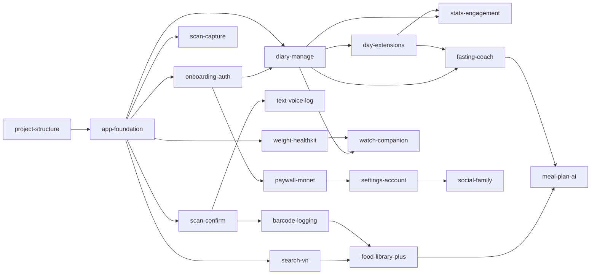

# CaloAI - Project Implementation Roadmap

**Version**: 1.0
**Date**: 2026-09-28
**Author**: AI Research Agent
**Status**: Draft
**Dependencies**: PRD.md, Project_Overview.md, Use_Cases.md, Functional_Requirements.md, Wireframes.md

> Quy ước ID chuẩn: UC-001..UC-022 (Use_Cases), FR-001..FR-056 + NFR-001..008 + BR-001..006 (Functional_Requirements), WF-001..WF-026 (Wireframes). Wireframes §1.3 dùng dãy FR nội bộ riêng để back-trace — roadmap này dùng số FR của Functional_Requirements làm chuẩn duy nhất.

---

## Overview

| Property | Value |
|----------|-------|
| Project | CaloAI (iOS 17+, SwiftUI 100%, SwiftData + Supabase) |
| Total Specs | 19 (13 MVP + 3 P1 + 3 P2) |
| Total Phases | 5 (Phase 1–3 = MVP 12 tuần; P1 = 4–6 tuần; P2 = chưa lên lịch) |
| Target Duration | Beta có monetization tuần 10, submit store tuần 12 (PRD §15) |
| Generated | 2026-09-28 |

## Scope Decision Record

Single source of truth cho scope. Mọi nhãn priority ở PRD §7, Overview §4, Use_Cases §7, FR §1.3 phải theo một legend:

| Tier | UC/Overview label | FR label | Code | In MVP? |
|------|-------------------|----------|------|---------|
| Tier 1 | Must-Have | High | P0 | Yes (MVP) |
| Tier 2 | Should-Have | Medium | P1 | No (P1 post-MVP) |
| Tier 3 | Could-Have / Nice-to-Have | Low | P2 | No (P2 future) |

**MVP definition:** MVP = 17 UC Tier 1 (UC-001–UC-007, UC-009–UC-016, UC-021, UC-022) + 46 FR P0 (FR-001–FR-005, FR-006–FR-025, FR-027, FR-031–FR-044, FR-051–FR-056 — trừ FR-026) + 2 promotions ghi dưới. Mọi spec trong Phase 1–3 chỉ phủ FR/UC Tier 1 hoặc promotion đã duyệt.

**MVP giữ (lý do):** onboarding + goal engine (activation ≥60%); 5 đường log photo/barcode/text-voice/search + confirm human-in-the-loop (wedge <10s/bữa); diary + macro ring + detail/edit/delete/relog (vòng lặp 3–4 lần/ngày); water/exercise/weight/HealthKit 2 chiều (lợi thế iOS); paywall minh bạch + trial + verify server (release-blocker); settings/offline/xóa-export (App Review bắt buộc).

**MVP cắt (lý do):**
| Cắt khỏi MVP | Đi đâu | Lý do |
|---|---|---|
| Meal-delivery/commerce (kiểu Calo Trung Đông) | Loại hẳn (không vào cả P2) | Mô hình vận hành nấu + giao khác hoàn toàn; PRD §6 out-of-scope |
| Social feed/groups công khai | P2 (`social-family`) | Chỉ có ý nghĩa sau khi retention đạt D30 ≥8%; rủi ro privacy |
| Family plan, referral phức tạp | P2 (`social-family`) | Không kiểm chứng giả định sinh tử MVP |
| Apple Watch companion | P2 (`watch-companion`) | Persona gym phụ; iPhone-first theo PRD §9 |
| Meal plan AI tuần + grocery list | P2 (`meal-plan-ai`) | Đắt AI cost, cần DB 1500 + coach ổn định trước |
| Đa ngôn ngữ ngoài Việt + Anh | P2 | Thị trường đầu VN + US/EU tiếng Anh đủ |
| Fasting timer, streaks/push/widget đầy đủ, coach chat, stats sâu, VN DB 1500 | P1 (4–6 tuần sau launch) | Giữ MVP hẹp để kiểm chứng đúng 1 giả định: log 2+ bữa/ngày × 7 ngày + trả tiền scan unlimited |

**Scope rules (enforced):** spec/phase thuộc MVP iff mọi UC/FR nó phủ là Tier 1 hoặc promotion đã duyệt; UC là recovery/critical path của flow MVP thì phải Tier 1.

**Scope Promotions (lệch so với UC/FR gốc, có lý do):**
| UC/FR | Gốc | Thành | Lý do |
|---|---|---|---|
| UC-019, UC-020 | P2 (UC §7.3) | P1 | FR-048–050 đã P1 từ đầu; fasting + coach là gap đối thủ, cần ngay sau MVP |
| FR-044 (history xem theo ngày, minimal) | P0 trong UC-017 (P1) | MVP-partial | Support bắt buộc cho relog P0 (FR-036/UC-012); chỉ calendar + snapshot ngày, không stats/CSV |
| FR-028-subset (tạo nhanh từ barcode-miss, inline) | P1 | MVP-partial | Recovery path bắt buộc của barcode P0 (FR-017); full editor WF-016 vẫn P1 |

**Scope Clarifications (mâu thuẫn nguồn, đã chốt):**
| Vấn đề | Chốt |
|---|---|
| Overview §4.1 liệt kê UC-018 ở dòng MVP, nhưng UC §7.2 + FR-046/047 + PRD §7 đều P1 | UC-018 giữ nguyên P1; MVP không có push/widget (sang P1 `stats-engagement`) |
| Wireframes §1.3 đánh số FR nội bộ khác FR doc | Số FR trong roadmap = Functional_Requirements (FR-001..056); bảng trace §Feature→Screen ghi chú chỗ lệch |

## Project Structure

### Directories

```
CaloAI/
├── App/                          # entry, routing, DI
│   ├── CaloAIApp.swift
│   ├── RootRouter.swift           # Splash → quiz/login/home (FR-006)
│   └── DIContainer.swift          # Manual Factory/Environment
├── Core/                         # dùng chung, không UI nghiệp vụ
│   ├── DesignSystem/             # tokens, theme, typography
│   ├── Networking/               # APIClient, Edge Functions client, retry
│   ├── Persistence/              # SwiftData schema + SyncEngine (FR-056)
│   ├── HealthKit/                # HKService read/write (FR-042/043)
│   ├── StoreKit/                 # PaywallService + verify (FR-053)
│   ├── Push/                     # APNs scheduling (P1)
│   ├── Analytics/                # core events PRD §12
│   └── Utils/                    # formatters, image-hash, validators
├── Features/                     # mỗi feature: Views + ViewModels + UseCases
│   ├── Onboarding/ Auth/ Scan/ Diary/ Search/
│   ├── Weight/ Paywall/ Settings/ History/ Fasting/ Coach/
├── Services/                     # remote + AI
│   ├── AIService/                # Gemini primary / GPT-4o-mini fallback (FR-008)
│   ├── FoodDB/                   # VN DB seed 500 → 1500, FTS search (FR-023)
│   └── ImageCache/               # perceptual hash cache 30 ngày (FR-013)
├── Shared/                       # components dùng chung (định nghĩa 1 nơi)
│   └── Components/               # MacroRing, FoodRow, ConfirmSheet, EmptyState…
├── CaloAIWidget/                 # WidgetExtension (P1, FR-047)
└── Supabase/                     # migrations + edge funcs (ai-proxy, verify-receipt)
```

### Files

| Path | Type |
|------|------|
| App/CaloAIApp.swift, RootRouter.swift, DIContainer.swift | entry/routing/DI |
| Core/DesignSystem/Theme.swift, Tokens.swift | design tokens |
| Core/Persistence/Models/*.swift (MealLog, FoodItem, WeightHistory, WaterLog) | model |
| Core/Persistence/SyncEngine.swift | service (delta sync, last-write-wins BR-004) |
| Core/Networking/APIClient.swift, EdgeClient.swift | service |
| Core/HealthKit/HKService.swift | service |
| Core/StoreKit/PaywallService.swift | service |
| Core/Analytics/Analytics.swift (16 core events PRD §12) | service |
| Services/AIService/FoodVisionService.swift | service |
| Services/FoodDB/FoodDatabase.swift (seed 500 MVP → 1500 P1) | service |
| Shared/Components/*.swift (định nghĩa 1 nơi, các spec khác tham chiếu) | view |

## Phase Timeline

| Phase | Specs | Duration | Entry Criteria | Deliverables | Exit Criteria |
|-------|-------|---------|----------------|--------------|--------------|
| Phase 1: Foundation (w1–4) | project-structure, app-foundation, onboarding-auth | 4 tuần | PRD duyệt (w1); 7 defaults PRD §14 khóa (w2); Figma link có | Project build được; Design System + tokens; quiz → goal → login chạy; VN DB seed 500 local; analytics/crash log đủ 16 core events | Cold start <1.5s; quiz <90s, TDEE ±10%; Apple login <5s; search seed <500ms local |
| Phase 2: Core (w5–8) | scan-capture, scan-confirm, barcode-logging, text-voice-log, search-vn, diary-manage, day-extensions, weight-healthkit, paywall-monet, settings-account | 4 tuần | Phase 1 exit đạt; Edge ai-proxy + VN RAG chạy staging; StoreKit products có | Scan pipeline thật p95 <5s; 5 đường log → diary; HealthKit 2 chiều; paywall + trial + verify; offline queue + delta sync | Scan p95 <5s (4G); conf<60% khóa Lưu; quota 4th scan → paywall; restore <5s; sync <30s không mất log; alpha build w7 |
| Phase 3: Polish & Launch (w9–12) | (không spec mới — hardening toàn bộ MVP) | 4 tuần | Alpha + checklist PRD §9 xong | A11y (VoiceOver/Dynamic Type AX5), perf, beta công khai + monetization, store metadata VN+EN, privacy manifest, xóa/export TK | crash-free ≥99.3% beta; scan 50 món Việt đạt; billing minh bạch pass; beta w10, submit w12 |
| P1: Retention+ (sau launch 4–6 tuần) | food-library-plus, stats-engagement, fasting-coach | 4–6 tuần | D1/D7 + trial-to-paid có tín hiệu; VN DB review pipeline sẵn | DB 1500 + favorite + custom/recipe; stats + CSV; streaks/push/widget; fasting 16:8 + cảnh báo carb; coach chat | Stats render <1s; push ≤3/ngày; coach có disclaimer; CSV mở được Numbers/Excel |
| P2: Expand (chưa lên lịch, theo retention/revenue) | meal-plan-ai, watch-companion, social-family | chưa lên lịch | D30 ≥8% + trial-to-paid ≥8% (PRD §5) | Meal plan tuần + grocery; Watch companion; social/groups + family (cân nhắc privacy) | Gate P2 chỉ mở khi ngưỡng PRD đạt; meal-delivery vẫn loại hẳn |

### Phase 1 goals (w1–4)
- Setup: Swift 6, SwiftUI, SwiftData schema (MealLog/FoodItem/WeightHistory/WaterLog), DI manual, SwiftLint; Design System + `DESIGN_TOKEN_caloai.json`.
- Onboarding + goal engine (FR-001–003) + auth Apple/Guest + splash routing (FR-004–006).
- VN DB seed 500 món có nguồn (Viện DD/USDA) + FTS không dấu, search local <500ms.
- Analytics/crash: Firebase Analytics + Crashlytics, đủ 16 core events (PRD §12); QA checklist device thật (iPhone 12+).

### Phase 2 goals (w5–8) — FR batch
- Scan: FR-007/008/013/014 (capture, Edge→Gemini/fallback, image-hash cache, offline queue) + FR-009/010/011/012 (JSON items + confidence, khóa Lưu khi <60%, 3 mức + grams, human-in-the-loop).
- Log thay thế: FR-015–018 (barcode), FR-019–022 (text/voice VI), FR-023–025 + FR-027 (search + recent + quick-add).
- Diary: FR-031/032 (ring + Health Score), FR-033/034/035 (detail/sửa/xóa), FR-036 + FR-044-minimal (relog + history ngày), FR-037/038/039 (nước/vận động/steps).
- Health: FR-040/041 (cân + chart) + FR-042/043 (HK đọc/ghi, không upload raw).
- Monet: FR-051/052/053/054 (paywall minh bạch, trial 7d + restore, verify server, quota 3/ngày) + FR-055/056 (settings/xóa-export, offline-first).
- WF batch: WF-005–WF-015, WF-017-minimal, WF-020, WF-023–WF-026. UC batch: UC-001–007, UC-009–016, UC-021, UC-022.

### Phase 3 goals (w9–12)
- A11y bắt buộc: VoiceOver đọc remaining/macro, Dynamic Type không vỡ diary, contrast AA, chạm ≥44pt (NFR-007).
- Perf: cold start <1.5s, search <500ms, API p95 <800ms (NFR-001/003); scan 50 món Việt QA.
- Beta + store: trial/restore/HK accept-deny/offline→sync/billing-minh-bạch checklist; screenshots VN+EN; xóa tài khoản (release-blocker).

### Milestone mapping (PRD §15)
PRD duyệt w1 → khóa scope+defaults w2 → duyệt design w4 → alpha (scan+diary+goal) w7 → beta (+monetization, analytics) w10 → submit store w12.

### Estimation Assumptions
- Team: 2 dev iOS + 0.5 BE (Supabase/Edge) + AI team hỗ trợ pipeline; AI-assisted coding: có.
- 1 day = 6 ideal engineering hours; buffer/contingency: 20% đã gộp trong tuần phase.
- Lệch scaling contract (ghi nhận): Phase 2 chứa 10 spec nhỏ (mỗi spec ≤5 FR) chạy song song 2 track (AI/vision + app), thay vì tối đa 3 spec/phase — lý do: ép MVP 12 tuần, mỗi spec vẫn review/release độc lập; Phase 1/3/P1/P2 tuân thủ ≤3 spec/phase.
- VN DB seed do AI + chuyên gia dinh dưỡng review ngoài critical path code.

## Feature→Screen Mapping

| Feature Spec | Screens (WF) | Archetype | Source UC Section |
|-------------|--------------|-----------|-------------------|
| project-structure | N/A (dirs/files) | — | — |
| app-foundation | WF-001 (Splash), WF-024 (Error/offline) | Consumption / Management | UC-001, UC-002, UC-022 |
| onboarding-auth | WF-002 (Quiz), WF-003 (Goal result), WF-004 (Login) | Action / Consumption / Action | UC-001, UC-002 |
| scan-capture | WF-006 (Camera scan) | Action | UC-003 |
| scan-confirm | WF-007 (AI result confirm) | Action+Management | UC-004 (UC-006 dùng ké confirm) |
| barcode-logging | WF-010 (Barcode scanner) + quick-create sheet inline (FR-017/028-subset) | Action | UC-005 |
| text-voice-log | WF-011 (Text/voice) → dùng ConfirmSheet của scan-confirm | Action | UC-006 |
| search-vn | WF-008 (Food search) | Discovery | UC-007 |
| diary-manage | WF-005 (Home), WF-012 (Diary), WF-009 (Food detail), WF-023 (Delete modal), WF-026 (Empty) | Discovery / Management / Consumption / Action | UC-009, UC-010, UC-011 |
| day-extensions | WF-017-minimal (History ngày + relog) | Management | UC-012, UC-013, UC-014, UC-017-min |
| weight-healthkit | WF-013 (Weight trend), WF-020 (HK permission) | Management / Action | UC-015, UC-016 |
| paywall-monet | WF-014 (Paywall), WF-025 (Subscription manage) | Action / Management | UC-021 |
| settings-account | WF-015 (Profile/Settings) | Management | UC-022 |
| food-library-plus (P1) | WF-016 (Custom editor) + tab Favorite ở WF-008 (mở rộng, chủ sở hữu WF-008 là search-vn) | Action | UC-008, UC-007-ext |
| stats-engagement (P1) | WF-017-full (Stats + CSV), WF-021 (Push perm), WF-022 (Widget) | Management / Action / Consumption | UC-017-full, UC-018 |
| fasting-coach (P1) | WF-018 (Fasting timer), WF-019 (Coach chat) | Action / Social | UC-019, UC-020 |
| meal-plan-ai (P2) | chưa lên lịch (kickoff P2 sinh WF mới) | chưa lên lịch | PRD §6 backlog |
| watch-companion (P2) | chưa lên lịch | chưa lên lịch | PRD §6 backlog |
| social-family (P2) | chưa lên lịch | chưa lên lịch | PRD §6 backlog (social/family) |

> Cross-spec pointers (cơ chế dùng chung định nghĩa 1 nơi): ConfirmSheet + serving recalc do scan-confirm sở hữu, text-voice-log tham chiếu; paywall 2-card monthly/yearly + cancel guide do paywall-monet sở hữu duy nhất, settings-account tham chiếu (cấm mâu thuẫn in-app vs App Store vs deep-link); quota badge ở WF-006 do paywall-monet định nghĩa logic, scan-capture hiển thị; streak badge ở WF-005 do stats-engagement thêm vào (chủ WF-005 là diary-manage).

## Spec Registry

### Phase 1: Foundation

| Spec ID | Status | Priority | Depends On | Summary | Screens (WF) | Files Created | Key Functions / Components | Covers (FR, UC, WF) |
|---------|--------|----------|-----------|---------|--------------|---------------|---------------------------|---------------------|
| `project-structure` | ready | 1 | None | Dựng cây thư mục + file rỗng, SwiftLint, scheme beta/store; không chứa code nghiệp vụ | N/A | App/, Core/, Features/, Services/, Shared/, Supabase/ | n/a (dirs/files) | N/A |
| `app-foundation` | ready | 2 | project-structure | Design System + tokens + SwiftData schema + SyncEngine + Edge client + analytics 16 events + splash routing + VN DB seed 500 + error/offline shell | WF-001, WF-024 | Theme.swift, Models/*.swift, SyncEngine.swift, EdgeClient.swift, Analytics.swift, FoodDatabase.swift (+seed) | RootRouter, SyncEngine.sync(), Analytics.log(), FoodDatabase.search() | FR-006, FR-056; UC-001, UC-002, UC-022; WF-001, WF-024 |
| `onboarding-auth` | ready | 3 | app-foundation | Quiz 6–8 câu + TDEE Mifflin-St Jeor + goal + login Apple/Guest + privacy consent | WF-002, WF-003, WF-004 | QuizView, GoalResultView, LoginView, GoalEngine, AuthService | GoalEngine.compute(), AuthService.signInApple() | FR-001–FR-005; UC-001, UC-002; WF-002–WF-004 |

### Phase 2: Core

| Spec ID | Status | Priority | Depends On | Summary | Screens (WF) | Files Created | Key Functions / Components | Covers (FR, UC, WF) |
|---------|--------|----------|-----------|---------|--------------|---------------|---------------------------|---------------------|
| `scan-capture` | pending | 4 | app-foundation | Chụp/crop/nén <1MB + Edge→Gemini/fallback + image-hash cache + offline queue | WF-006 | ScanView, CameraService, FoodVisionService, ImageCache | FoodVisionService.estimate(), ImageCache.lookup() | FR-007, 008, 013, 014; UC-003; WF-006 |
| `scan-confirm` | pending | 5 | app-foundation (+ mock ScanResult, không chặn bởi scan-capture) | Items + confidence + khóa Lưu khi <60% + 3 mức + grams + human-in-the-loop; sở hữu ConfirmSheet dùng chung | WF-007 | ConfirmView, ConfirmViewModel, ConfirmSheet, ConfidenceBadge | recalc(), confirmAll() | FR-009, 010, 011, 012; UC-004; WF-007 |
| `barcode-logging` | pending | 6 | app-foundation, scan-confirm (dùng ConfirmSheet khi cần) | Quét UPC/EAN <2s + DB nội bộ + fallback + miss→quick-create inline (FR-028-subset) | WF-010 | BarcodeView, BarcodeService | BarcodeService.lookup(), QuickCreateSheet | FR-015, 016, 017, 018; UC-005; WF-010 |
| `text-voice-log` | pending | 7 | app-foundation, scan-confirm (ConfirmSheet) | Nhập text VI có/không dấu + voice STT + parse → confirm chung | WF-011 | TextLogView, VoiceButton, TextParser | TextParser.parse() | FR-019, 020, 021, 022; UC-006; WF-011 |
| `search-vn` | pending | 8 | app-foundation | Search 500–800 món <500ms + kcal/suất Việt + recent + quick-add; sở hữu WF-008 | WF-008 | SearchView, FoodRow, QuickAddButton | FoodDatabase.search(), quickAdd() | FR-023, 024, 025, 027; UC-007; WF-008 |
| `diary-manage` | pending | 9 | app-foundation, onboarding-auth | Home ring + diary theo bữa + detail/sửa/xóa + Undo + empty states; sở hữu WF-005/009/012/023/026 | WF-005, WF-009, WF-012, WF-023, WF-026 | HomeView, DiaryView, FoodDetailView, MacroRing, UndoToast | DiaryStore, MacroRing.update() | FR-031, 032, 033, 034, 035; UC-009, 010, 011; WF-005, 009, 012, 023, 026 |

| `day-extensions` | pending | 10 | app-foundation, diary-manage (UI rows WF-005/012 qua pointer) | Relog 1 chạm + water + exercise/steps + history-ngày minimal (FR-044); sở hữu WF-017-minimal | WF-017-min | HistoryMiniView, WaterStepper, ExerciseRow | RelogService.relog(), WaterStore.add() | FR-036, 037, 038, 039, 044; UC-012, 013, 014, 017-min; WF-017 |
| `weight-healthkit` | pending | 11 | app-foundation | Cân <10s + chart 7/30/90 + HK đọc/ghi (không upload raw) | WF-013, WF-020 | WeightView, WeightChart, HKService, HKPermissionSheet | HKService.sync(), WeightStore.log() | FR-040, 041, 042, 043; UC-015, 016; WF-013, WF-020 |
| `paywall-monet` | pending | 12 | app-foundation, onboarding-auth | Paywall 2-card minh bạch + trial 7d + restore + verify server + quota 3/ngày; sở hữu cơ chế sub duy nhất | WF-014, WF-025 | PaywallView, SubManageView, PaywallService | PaywallService.verify(), QuotaStore.canScan() | FR-051, 052, 053, 054; UC-021; WF-014, WF-025 |
| `settings-account` | pending | 13 | app-foundation, paywall-monet (cancel guide tham chiếu) | Sửa goal/đơn vị/ngôn ngữ + export + xóa TK 2 bước; offline banner | WF-015 | SettingsView, AccountService | AccountService.delete(), export() | FR-055 (+FR-056 dùng SyncEngine của app-foundation); UC-022; WF-015 |

### P1: Retention+ (4–6 tuần)

| Spec ID | Status | Priority | Depends On | Summary | Screens (WF) | Files Created | Key Functions / Components | Covers (FR, UC, WF) |
|---------|--------|----------|-----------|---------|--------------|---------------|---------------------------|---------------------|
| `food-library-plus` | planned | 14 | search-vn, barcode-logging | Favorite 50 + custom food + recipe + dùng lại 1 chạm; sở hữu WF-016, mở rộng tab Fav ở WF-008 | WF-016 (+WF-008 ext) | CustomEditorView, RecipeService | RecipeService.total() | FR-026, 028, 029, 030; UC-008; WF-016 |
| `stats-engagement` | planned | 15 | diary-manage, day-extensions (mở rộng WF-017) | Stats tuần/tháng + CSV + streaks/push ≤3/ngày + widget; badge streak ở WF-005 qua pointer | WF-017-full, WF-021, WF-022 | StatsView, StreakEngine, WidgetBundle | StatsEngine.weekly(), StreakEngine.tick() | FR-045, 046, 047; UC-017-full, UC-018; WF-017, 021, 022 |
| `fasting-coach` | planned | 16 | diary-manage, day-extensions | Fasting 16:8 (+14:10/18:6/20:4) + cảnh báo carb + coach chat RAG 7 ngày + disclaimer y khoa | WF-018, WF-019 | FastingView, FastingTimer, CoachView | FastingTimer.start/end(), CoachService.ask() | FR-048, 049, 050; UC-019, UC-020; WF-018, WF-019 |

### P2: Expand (chưa lên lịch)

| Spec ID | Status | Priority | Depends On | Summary | Screens (WF) | Files Created | Key Functions / Components | Covers (FR, UC, WF) |
|---------|--------|----------|-----------|---------|--------------|---------------|---------------------------|---------------------|
| `meal-plan-ai` | deferred | 17 | fasting-coach, food-library-plus | Meal plan tuần + grocery list; FR sinh khi kickoff P2 | chưa lên lịch | chưa lên lịch | chưa lên lịch | PRD §6 backlog (chưa có FR) |
| `watch-companion` | deferred | 18 | diary-manage, weight-healthkit | Watch app xem ring + quick log; FR sinh khi kickoff P2 | chưa lên lịch | chưa lên lịch | chưa lên lịch | PRD §6 backlog (chưa có FR) |
| `social-family` | deferred | 19 | settings-account | Groups + family plan (cân nhắc privacy); meal-delivery loại hẳn, không vào spec này | chưa lên lịch | chưa lên lịch | chưa lên lịch | PRD §6 backlog (chưa có FR) |

## File Breakdown

### Phase 1: Foundation

| File Path | Type | Key Functions / Components | Covers |
|-----------|------|---------------------------|--------|
| App/CaloAIApp.swift, RootRouter.swift, DIContainer.swift | entry/routing/DI | CaloAIApp, RootRouter.route() | FR-006, UC-001/002 |
| Core/DesignSystem/Theme.swift, Tokens.swift | design system | Theme, spacing/typography tokens | NFR-007 |
| Core/Persistence/Models/MealLog.swift, FoodItem.swift, WeightHistory.swift, WaterLog.swift | model | @Model structs + updated_at | FR-056, BR-004 |
| Core/Persistence/SyncEngine.swift | service | sync(), resolveConflict() last-write-wins | FR-056 |
| Core/Networking/EdgeClient.swift | service | proxy AI key, rate-limit, retry | FR-008, NFR-005 |
| Core/Analytics/Analytics.swift | service | 16 core events (PRD §12) | activation/retention/revenue |
| Services/FoodDB/FoodDatabase.swift + seed_vn500.json | service/data | search() FTS không dấu <500ms | FR-023/024 |
| Features/Onboarding/QuizView.swift, GoalResultView.swift, GoalEngine.swift | view/service | GoalEngine.compute() Mifflin-St Jeor | FR-001–003, UC-001 |
| Features/Auth/LoginView.swift, AuthService.swift | view/service | signInApple(), guestMode() | FR-004/005, UC-002 |

### Phase 2: Core

| File Path | Type | Key Functions / Components | Covers |
|-----------|------|---------------------------|--------|
| Features/Scan/ScanView.swift, CameraService.swift | view/service | crop, nén <1MB | FR-007, UC-003 |
| Services/AIService/FoodVisionService.swift | service | estimate() Gemini→fallback, timeout 12s | FR-008/009 |
| Services/ImageCache/ImageCache.swift | service | perceptual hash, cache 30d, <500ms | FR-013 |
| Features/Scan/ConfirmView.swift, ConfirmSheet.swift, ConfidenceBadge.swift | view | recalc <100ms, khóa Lưu khi <60% | FR-009–012, UC-004 |
| Features/Scan/BarcodeView.swift, BarcodeService.swift, QuickCreateSheet.swift | view/service | lookup() <2s, prefill barcode | FR-015–018, UC-005 (+FR-028-subset) |
| Features/Scan/TextLogView.swift, TextParser.swift, VoiceButton.swift | view/service | parse() VI có/không dấu | FR-019–022, UC-006 |
| Features/Search/SearchView.swift, FoodRow.swift | view | quickAdd() <500ms + Undo | FR-023–025/027, UC-007 |
| Features/Diary/HomeView.swift, MacroRing.swift | view | ring realtime <500ms, Health Score | FR-031/032, UC-009 |
| Features/Diary/DiaryView.swift, FoodDetailView.swift, UndoToast.swift | view | edit/delete/relog rows, Undo 5s | FR-033–036, UC-010/011/012 |
| Features/History/HistoryMiniView.swift | view | calendar + snapshot ngày (minimal) | FR-044 |
| Features/Diary/WaterStepper.swift, ExerciseRow.swift | view | +250ml, MET burn, dedup HK | FR-037/038/039 |
| Features/Weight/WeightView.swift, WeightChart.swift | view | log <10s, chart 7/30/90 <1s | FR-040/041, UC-015 |
| Core/HealthKit/HKService.swift | service | observer query, read/write <3s nền | FR-039/042/043, UC-016 |
| Features/Paywall/PaywallView.swift, SubManageView.swift | view | 2-card, giá bill to, restore | FR-051/052, UC-021 |
| Core/StoreKit/PaywallService.swift, QuotaStore.swift | service | verify server, quota 3/ngày reset 0h | FR-053/054, BR-001/002 |
| Features/Settings/SettingsView.swift, AccountService.swift | view/service | goal/đơn vị/ngôn ngữ, export, xóa 2 bước | FR-055, UC-022 |

### P1: Retention+

| File Path | Type | Key Functions / Components | Covers |
|-----------|------|---------------------------|--------|
| Features/Search/CustomEditorView.swift, RecipeService.swift | view/service | kcal/100g, recipe ≥2 NL, unverified flag | FR-028/029/030, UC-008 |
| Features/History/StatsView.swift, StatsEngine.swift | view/service | weekly avg, adherence, CSV UTF-8 | FR-045, UC-017 |
| Features/Engagement/StreakEngine.swift, PushScheduler.swift | service | streak +1, push ≤3/ngày/timezone | FR-046, BR-005 |
| CaloAIWidget/CaloAIWidget.swift | widget | consumed/remaining, deep-link <2s | FR-047, UC-018 |
| Features/Fasting/FastingView.swift, FastingTimer.swift | view/service | 16:8 + variants, persisted kill-app | FR-048/049, UC-019 |
| Features/Coach/CoachView.swift, CoachService.swift | view/service | RAG 7 ngày, disclaimer y khoa | FR-050, UC-020 |

## Screen→File Breakdown

### Phase 1 (WF-001–WF-004, WF-024-shell)

| Screen (WF) | File Path | Key Functions / Components | Covers |
|-------------|-----------|---------------------------|--------|
| WF-001 Splash | App/RootRouter.swift | route() session/onboarding <1.5s | FR-006 |
| WF-002 Quiz | Features/Onboarding/QuizView.swift | 6–8 câu, Skip → goal mặc định | FR-001 |
| WF-003 Goal result | Features/Onboarding/GoalResultView.swift | TDEE + P/C/F + giải thích | FR-002/003 |
| WF-004 Login | Features/Auth/LoginView.swift | Apple/Guest + privacy consent | FR-004/005 |
| WF-024 shell | Core/Networking/EdgeClient.swift + banner component | retry, queue status | FR-056 |

### Phase 2 (WF-005–WF-015, WF-017-min, WF-020, WF-023–WF-026)

| Screen (WF) | File Path | Key Functions / Components | Covers |
|-------------|-----------|---------------------------|--------|
| WF-005 Home | Features/Diary/HomeView.swift, MacroRing.swift | ring + quick log + quota badge | FR-031/032, UC-009 |
| WF-006 Camera | Features/Scan/ScanView.swift | viewfinder, preview, quota lock | FR-007/008/013/014 |
| WF-007 Confirm | Features/Scan/ConfirmView.swift, ConfirmSheet.swift | items + confidence + 3 mức + Lưu gate | FR-009–012 |
| WF-008 Search | Features/Search/SearchView.swift | FTS + recent + quick-add | FR-023–025/027 |
| WF-009 Detail | Features/Diary/FoodDetailView.swift | serving/bữa/re-link/báo sai | FR-033/034 |
| WF-010 Barcode | Features/Scan/BarcodeView.swift | scanner + result sheet + miss→create | FR-015–018 |
| WF-011 Text/voice | Features/Scan/TextLogView.swift | parse preview + STT | FR-019–022 |
| WF-012 Diary | Features/Diary/DiaryView.swift | sections bữa + swipe + relog + nước/vận động | FR-031/034–039 |
| WF-013 Weight | Features/Weight/WeightView.swift | stepper + chart + delta | FR-040/041 |
| WF-014 Paywall | Features/Paywall/PaywallView.swift | 2-card + trial + restore | FR-051–054 |
| WF-015 Settings | Features/Settings/SettingsView.swift | goal/privacy/export/xóa | FR-055 |
| WF-017-min | Features/History/HistoryMiniView.swift | calendar + snapshot + relog | FR-036/044 |
| WF-020 HK perm | Core/HealthKit/HKService.swift + sheet | pre-permission + system dialog | FR-042/043 |
| WF-023 Delete modal | Features/Diary/UndoToast.swift + modal | confirm + Undo 5s | FR-035 |
| WF-024 States | Shared error banner + SyncEngine status | queue/retry/badge im lặng | FR-014/056 |
| WF-025 Sub manage | Features/Paywall/SubManageView.swift | trial countdown + cancel guide | FR-052 |
| WF-026 Empty | Shared/Components/EmptyState.swift | CTA theo ngữ cảnh | FR-031/044 |

### P1 (WF-016, WF-017-full, WF-018, WF-019, WF-021, WF-022)

| Screen (WF) | File Path | Key Functions / Components | Covers |
|-------------|-----------|---------------------------|--------|
| WF-016 Custom editor | Features/Search/CustomEditorView.swift | kcal/100g + recipe + unverified | FR-028–030 |
| WF-017-full | Features/History/StatsView.swift | stats + so sánh tuần + CSV | FR-045 |
| WF-018 Fasting | Features/Fasting/FastingView.swift | timer + plan + cảnh báo carb | FR-048/049 |
| WF-019 Coach | Features/Coach/CoachView.swift | chat + gợi ý deep-link search | FR-050 |
| WF-021 Push perm | Features/Engagement/PushScheduler.swift + sheet | opt-in + giờ bữa | FR-046 |
| WF-022 Widget | CaloAIWidget/CaloAIWidget.swift | số gọn + deep-link | FR-047 |

## Machine-Readable Dependencies

```json
{
  "project": "CaloAI",
  "generated": "2026-09-28",
  "phases": [
    {"phase": 1, "name": "Foundation (w1-4)", "duration_weeks": 4, "specs": ["project-structure", "app-foundation", "onboarding-auth"]},
    {"phase": 2, "name": "Core (w5-8)", "duration_weeks": 4, "specs": ["scan-capture", "scan-confirm", "barcode-logging", "text-voice-log", "search-vn", "diary-manage", "day-extensions", "weight-healthkit", "paywall-monet", "settings-account"]},
    {"phase": 3, "name": "Polish & Launch (w9-12)", "duration_weeks": 4, "specs": []},
    {"phase": 4, "name": "P1 Retention+ (4-6w)", "duration_weeks": 6, "specs": ["food-library-plus", "stats-engagement", "fasting-coach"]},
    {"phase": 5, "name": "P2 Expand (chưa lên lịch)", "duration_weeks": null, "specs": ["meal-plan-ai", "watch-companion", "social-family"]}
  ],
  "specs": {
    "project-structure": {"status": "ready", "priority": 1, "phase": 1, "depends_on": [], "blocks": ["app-foundation"], "covers": {"fr": [], "uc": [], "wf": []}, "files": [], "summary": "Cay thu muc + file rong, khong code nghiep vu", "screens": []},
    "app-foundation": {"status": "ready", "priority": 2, "phase": 1, "depends_on": ["project-structure"], "blocks": ["onboarding-auth", "scan-capture", "scan-confirm"], "covers": {"fr": ["FR-006", "FR-056"], "uc": ["UC-001", "UC-002", "UC-022"], "wf": ["WF-001", "WF-024"]}, "files": [{"path": "Core/Persistence/SyncEngine.swift", "functions": ["sync()", "resolveConflict()"], "covers": {"fr": ["FR-056"], "uc": ["UC-022"]}}, {"path": "Services/FoodDB/FoodDatabase.swift", "functions": ["search()"], "covers": {"fr": ["FR-023"], "uc": ["UC-007"]}}], "summary": "Design system + SwiftData + sync + Edge + analytics + DB seed 500", "screens": ["WF-001", "WF-024"]},
    "onboarding-auth": {"status": "ready", "priority": 3, "phase": 1, "depends_on": ["app-foundation"], "blocks": ["diary-manage", "paywall-monet"], "covers": {"fr": ["FR-001", "FR-002", "FR-003", "FR-004", "FR-005"], "uc": ["UC-001", "UC-002"], "wf": ["WF-002", "WF-003", "WF-004"]}, "files": [{"path": "Features/Onboarding/GoalEngine.swift", "functions": ["compute()"], "covers": {"fr": ["FR-002"], "uc": ["UC-001"]}}, {"path": "Features/Auth/AuthService.swift", "functions": ["signInApple()"], "covers": {"fr": ["FR-004"], "uc": ["UC-002"]}}], "summary": "Quiz + goal + login Apple/Guest", "screens": ["WF-002", "WF-003", "WF-004"]},
    "scan-capture": {"status": "pending", "priority": 4, "phase": 2, "depends_on": ["app-foundation"], "blocks": ["scan-confirm"], "covers": {"fr": ["FR-007", "FR-008", "FR-013", "FR-014"], "uc": ["UC-003"], "wf": ["WF-006"]}, "files": [{"path": "Services/AIService/FoodVisionService.swift", "functions": ["estimate()"], "covers": {"fr": ["FR-008"], "uc": ["UC-003"]}}, {"path": "Features/Scan/ScanView.swift", "functions": ["ScanView", "CameraService"], "covers": {"fr": ["FR-007"], "uc": ["UC-003"], "wf": ["WF-006"]}}], "summary": "Chup/crop + Edge AI + cache + queue", "screens": ["WF-006"]},
    "scan-confirm": {"status": "pending", "priority": 5, "phase": 2, "depends_on": ["app-foundation"], "blocks": ["barcode-logging", "text-voice-log"], "covers": {"fr": ["FR-009", "FR-010", "FR-011", "FR-012"], "uc": ["UC-004"], "wf": ["WF-007"]}, "files": [{"path": "Features/Scan/ConfirmView.swift", "functions": ["recalc()", "confirmAll()"], "covers": {"fr": ["FR-010", "FR-011", "FR-012"], "uc": ["UC-004"], "wf": ["WF-007"]}}], "summary": "Confirm human-in-the-loop + ConfirmSheet dung chung", "screens": ["WF-007"]},
    "barcode-logging": {"status": "pending", "priority": 6, "phase": 2, "depends_on": ["app-foundation", "scan-confirm"], "blocks": ["food-library-plus"], "covers": {"fr": ["FR-015", "FR-016", "FR-017", "FR-018"], "uc": ["UC-005"], "wf": ["WF-010"]}, "files": [{"path": "Features/Scan/BarcodeService.swift", "functions": ["lookup()"], "covers": {"fr": ["FR-016"], "uc": ["UC-005"], "wf": ["WF-010"]}}], "summary": "Barcode + fallback + quick-create inline", "screens": ["WF-010"]},
    "text-voice-log": {"status": "pending", "priority": 7, "phase": 2, "depends_on": ["app-foundation", "scan-confirm"], "blocks": [], "covers": {"fr": ["FR-019", "FR-020", "FR-021", "FR-022"], "uc": ["UC-006"], "wf": ["WF-011"]}, "files": [{"path": "Features/Scan/TextParser.swift", "functions": ["parse()"], "covers": {"fr": ["FR-019", "FR-021"], "uc": ["UC-006"], "wf": ["WF-011"]}}], "summary": "Text/voice VI + parse + confirm chung", "screens": ["WF-011"]},
    "search-vn": {"status": "pending", "priority": 8, "phase": 2, "depends_on": ["app-foundation"], "blocks": ["food-library-plus"], "covers": {"fr": ["FR-023", "FR-024", "FR-025", "FR-027"], "uc": ["UC-007"], "wf": ["WF-008"]}, "files": [{"path": "Features/Search/SearchView.swift", "functions": ["quickAdd()"], "covers": {"fr": ["FR-027"], "uc": ["UC-007"], "wf": ["WF-008"]}}], "summary": "Search mon Viet + recent + quick-add, chu WF-008", "screens": ["WF-008"]},
    "diary-manage": {"status": "pending", "priority": 9, "phase": 2, "depends_on": ["app-foundation", "onboarding-auth"], "blocks": ["day-extensions", "stats-engagement", "fasting-coach"], "covers": {"fr": ["FR-031", "FR-032", "FR-033", "FR-034", "FR-035"], "uc": ["UC-009", "UC-010", "UC-011"], "wf": ["WF-005", "WF-009", "WF-012", "WF-023", "WF-026"]}, "files": [{"path": "Features/Diary/DiaryView.swift", "functions": ["DiaryStore"], "covers": {"fr": ["FR-031"], "uc": ["UC-009"], "wf": ["WF-012"]}}, {"path": "Features/Diary/HomeView.swift", "functions": ["MacroRing"], "covers": {"fr": ["FR-032"], "uc": ["UC-009"], "wf": ["WF-005"]}}], "summary": "Home ring + diary + detail/edit/delete", "screens": ["WF-005", "WF-009", "WF-012", "WF-023", "WF-026"]},
    "day-extensions": {"status": "pending", "priority": 10, "phase": 2, "depends_on": ["app-foundation", "diary-manage"], "blocks": ["stats-engagement", "fasting-coach"], "covers": {"fr": ["FR-036", "FR-037", "FR-038", "FR-039", "FR-044"], "uc": ["UC-012", "UC-013", "UC-014", "UC-017"], "wf": ["WF-017"]}, "files": [{"path": "Features/History/HistoryMiniView.swift", "functions": ["daySnapshot()"], "covers": {"fr": ["FR-044"], "uc": ["UC-017"], "wf": ["WF-017"]}}], "summary": "Relog + nuoc + van dong + history-ngay minimal", "screens": ["WF-017"]},
    "weight-healthkit": {"status": "pending", "priority": 11, "phase": 2, "depends_on": ["app-foundation"], "blocks": [], "covers": {"fr": ["FR-040", "FR-041", "FR-042", "FR-043"], "uc": ["UC-015", "UC-016"], "wf": ["WF-013", "WF-020"]}, "files": [{"path": "Core/HealthKit/HKService.swift", "functions": ["sync()"], "covers": {"fr": ["FR-042", "FR-043"], "uc": ["UC-016"], "wf": ["WF-020"]}}], "summary": "Can + chart + HealthKit 2 chieu", "screens": ["WF-013", "WF-020"]},
    "paywall-monet": {"status": "pending", "priority": 12, "phase": 2, "depends_on": ["app-foundation", "onboarding-auth"], "blocks": ["settings-account"], "covers": {"fr": ["FR-051", "FR-052", "FR-053", "FR-054"], "uc": ["UC-021"], "wf": ["WF-014", "WF-025"]}, "files": [{"path": "Core/StoreKit/PaywallService.swift", "functions": ["verify()"], "covers": {"fr": ["FR-053"], "uc": ["UC-021"], "wf": ["WF-014"]}}], "summary": "Paywall minh bach + trial + verify + quota", "screens": ["WF-014", "WF-025"]},
    "settings-account": {"status": "pending", "priority": 13, "phase": 2, "depends_on": ["app-foundation", "paywall-monet"], "blocks": ["social-family"], "covers": {"fr": ["FR-055"], "uc": ["UC-022"], "wf": ["WF-015"]}, "files": [{"path": "Features/Settings/AccountService.swift", "functions": ["delete()", "export()"], "covers": {"fr": ["FR-055"], "uc": ["UC-022"], "wf": ["WF-015"]}}], "summary": "Settings + export + xoa TK (FR-056 dung SyncEngine)", "screens": ["WF-015"]},
    "food-library-plus": {"status": "planned", "priority": 14, "phase": 4, "depends_on": ["search-vn", "barcode-logging"], "blocks": ["meal-plan-ai"], "covers": {"fr": ["FR-026", "FR-028", "FR-029", "FR-030"], "uc": ["UC-008"], "wf": ["WF-016"]}, "files": [{"path": "Features/Search/CustomEditorView.swift", "functions": ["save()"], "covers": {"fr": ["FR-028"], "uc": ["UC-008"], "wf": ["WF-016"]}}], "summary": "Favorite + custom/recipe, chu WF-016", "screens": ["WF-016"]},
    "stats-engagement": {"status": "planned", "priority": 15, "phase": 4, "depends_on": ["diary-manage", "day-extensions"], "blocks": [], "covers": {"fr": ["FR-045", "FR-046", "FR-047"], "uc": ["UC-017", "UC-018"], "wf": ["WF-017", "WF-021", "WF-022"]}, "files": [{"path": "Features/History/StatsView.swift", "functions": ["weekly()"], "covers": {"fr": ["FR-045"], "uc": ["UC-017"], "wf": ["WF-017"]}}], "summary": "Stats + CSV + streaks/push/widget", "screens": ["WF-017", "WF-021", "WF-022"]},
    "fasting-coach": {"status": "planned", "priority": 16, "phase": 4, "depends_on": ["diary-manage", "day-extensions"], "blocks": ["meal-plan-ai"], "covers": {"fr": ["FR-048", "FR-049", "FR-050"], "uc": ["UC-019", "UC-020"], "wf": ["WF-018", "WF-019"]}, "files": [{"path": "Features/Coach/CoachService.swift", "functions": ["ask()"], "covers": {"fr": ["FR-050"], "uc": ["UC-020"], "wf": ["WF-019"]}}], "summary": "Fasting + canh bao carb + coach RAG", "screens": ["WF-018", "WF-019"]},
    "meal-plan-ai": {"status": "deferred", "priority": 17, "phase": 5, "depends_on": ["fasting-coach", "food-library-plus"], "blocks": [], "covers": {"fr": [], "uc": [], "wf": []}, "files": [], "summary": "Meal plan tuan + grocery (FR sinh kickoff P2)", "screens": []},
    "watch-companion": {"status": "deferred", "priority": 18, "phase": 5, "depends_on": ["diary-manage", "weight-healthkit"], "blocks": [], "covers": {"fr": [], "uc": [], "wf": []}, "files": [], "summary": "Watch xem ring + quick log", "screens": []},
    "social-family": {"status": "deferred", "priority": 19, "phase": 5, "depends_on": ["settings-account"], "blocks": [], "covers": {"fr": [], "uc": [], "wf": []}, "files": [], "summary": "Groups + family, can nhac privacy; meal-delivery loai han", "screens": []}
  }
}
```

## Dependency Graph



## Traceability Matrix

### FR → Spec → File Mapping

| FR ID | Description | Phase | Spec | File |
|-------|-------------|-------|------|------|
| FR-001 | Quiz 6–8 câu <90s | 1 | `onboarding-auth` | QuizView.swift |
| FR-002 | Goal engine TDEE + macro | 1 | `onboarding-auth` | GoalEngine.swift |
| FR-003 | Goal + giải thích | 1 | `onboarding-auth` | GoalResultView.swift |
| FR-004 | Sign in with Apple | 1 | `onboarding-auth` | AuthService.swift |
| FR-005 | Guest mode giới hạn | 1 | `onboarding-auth` | AuthService.swift |
| FR-006 | Splash routing | 1 | `app-foundation` | RootRouter.swift |
| FR-007 | Chụp/crop + nén <1MB | 2 | `scan-capture` | CameraService.swift |
| FR-008 | Edge → Gemini/fallback | 2 | `scan-capture` | FoodVisionService.swift |
| FR-009 | JSON items + confidence | 2 | `scan-confirm` | ConfirmView.swift |
| FR-010 | Conf<60% bắt nhập tay | 2 | `scan-confirm` | ConfirmView.swift |
| FR-011 | 3 mức + grams tay | 2 | `scan-confirm` | ConfirmSheet.swift |
| FR-012 | Không lưu khi chưa xác nhận | 2 | `scan-confirm` | ConfirmViewModel.swift |
| FR-013 | Cache image-hash | 2 | `scan-capture` | ImageCache.swift |
| FR-014 | Queue offline + p95<5s | 2 | `scan-capture` | ScanView.swift + SyncEngine |
| FR-015 | Quét UPC/EAN <2s | 2 | `barcode-logging` | BarcodeView.swift |
| FR-016 | DB nội bộ + fallback | 2 | `barcode-logging` | BarcodeService.swift |
| FR-017 | Miss → gợi ý custom | 2 | `barcode-logging` | QuickCreateSheet.swift |
| FR-018 | Serving barcode → lưu | 2 | `barcode-logging` | BarcodeView.swift |
| FR-019 | Nhập text món + lượng | 2 | `text-voice-log` | TextParser.swift |
| FR-020 | Voice tiếng Việt | 2 | `text-voice-log` | VoiceButton.swift |
| FR-021 | Parse → ±20% sau xác nhận | 2 | `text-voice-log` | TextParser.swift |
| FR-022 | Xác nhận text/voice | 2 | `text-voice-log` | ConfirmSheet (tham chiếu) |
| FR-023 | Search <500ms 500–800 món | 1–2 | `app-foundation` (seed) + `search-vn` (UI) | FoodDatabase.swift / SearchView.swift |
| FR-024 | Kcal/suất Việt + nguồn | 2 | `search-vn` | SearchView.swift, FoodRow.swift |
| FR-025 | Recent 20 món | 2 | `search-vn` | SearchView.swift |
| FR-026 | Favorite 50 món | P1 | `food-library-plus` | SearchView (tab Fav ext) |
| FR-027 | Quick-add 1 chạm | 2 | `search-vn` | QuickAddButton.swift |
| FR-028 | Tạo custom food | P1 (subset MVP) | `food-library-plus` (+subset trong `barcode-logging`) | CustomEditorView.swift / QuickCreateSheet |
| FR-029 | Recipe nhiều NL | P1 | `food-library-plus` | RecipeService.swift |
| FR-030 | Dùng lại custom/recipe | P1 | `food-library-plus` | SearchView.swift |
| FR-031 | Diary + ring realtime | 2 | `diary-manage` | DiaryView.swift, MacroRing.swift |
| FR-032 | Remaining + Health Score | 2 | `diary-manage` | HomeView.swift |
| FR-033 | Food detail | 2 | `diary-manage` | FoodDetailView.swift |
| FR-034 | Sửa log | 2 | `diary-manage` | FoodDetailView.swift |
| FR-035 | Xóa log + modal | 2 | `diary-manage` | UndoToast.swift + modal |
| FR-036 | Relog từ history | 2 | `day-extensions` | DiaryView.swift (nút relog) |
| FR-037 | Water log + goal | 2 | `day-extensions` | WaterStepper.swift |
| FR-038 | Exercise tay | 2 | `day-extensions` | ExerciseRow.swift |
| FR-039 | Steps/workout HK | 2 | `day-extensions` (+HKService) | ExerciseRow.swift |
| FR-040 | Weight log <10s | 2 | `weight-healthkit` | WeightView.swift |
| FR-041 | Chart 7/30/90 | 2 | `weight-healthkit` | WeightChart.swift |
| FR-042 | HK đọc | 2 | `weight-healthkit` | HKService.swift |
| FR-043 | HK ghi dietary | 2 | `weight-healthkit` | HKService.swift |
| FR-044 | History theo ngày (minimal) | 2 | `day-extensions` | HistoryMiniView.swift |
| FR-045 | Stats + CSV | P1 | `stats-engagement` | StatsView.swift |
| FR-046 | Streaks + push | P1 | `stats-engagement` | StreakEngine.swift |
| FR-047 | Widget | P1 | `stats-engagement` | CaloAIWidget.swift |
| FR-048 | Fasting timer | P1 | `fasting-coach` | FastingTimer.swift |
| FR-049 | Cảnh báo carb | P1 | `fasting-coach` | FastingView.swift |
| FR-050 | Coach chat | P1 | `fasting-coach` | CoachService.swift |
| FR-051 | Paywall minh bạch | 2 | `paywall-monet` | PaywallView.swift |
| FR-052 | Trial 7d + restore | 2 | `paywall-monet` | PaywallService.swift |
| FR-053 | Verify StoreKit server | 2 | `paywall-monet` | PaywallService.swift + Edge |
| FR-054 | Quota 3 scans + upsell | 2 | `paywall-monet` | QuotaStore.swift |
| FR-055 | Settings + xóa/export | 2 | `settings-account` | AccountService.swift |
| FR-056 | Offline + delta sync | 1–2 | `app-foundation` | SyncEngine.swift |

### UC → Spec → Screen Mapping (đủ 22/22 UC)

| UC ID | Description | Phase | Spec | Screen (WF) | File |
|-------|-------------|-------|------|-------------|------|
| UC-001 | Quiz + goal | 1 | `onboarding-auth` | WF-002, WF-003 | QuizView.swift |
| UC-002 | Apple/Guest | 1 | `onboarding-auth` | WF-004 (WF-001 routing ở foundation) | LoginView.swift |
| UC-003 | Photo scan | 2 | `scan-capture` | WF-006 | ScanView.swift |
| UC-004 | Confirm/edit AI | 2 | `scan-confirm` | WF-007 | ConfirmView.swift |
| UC-005 | Barcode | 2 | `barcode-logging` | WF-010 | BarcodeView.swift |
| UC-006 | Text/voice | 2 | `text-voice-log` | WF-011 → WF-007 | TextLogView.swift |
| UC-007 | Search + quick add | 2 | `search-vn` | WF-008 | SearchView.swift |
| UC-008 | Custom/recipe | P1 (+subset MVP) | `food-library-plus` (+`barcode-logging` subset) | WF-016 | CustomEditorView.swift |
| UC-009 | Diary + ring | 2 | `diary-manage` | WF-005, WF-012 | HomeView/DiaryView.swift |
| UC-010 | Detail/edit | 2 | `diary-manage` | WF-009 | FoodDetailView.swift |
| UC-011 | Delete | 2 | `diary-manage` | WF-012 + WF-023 | UndoToast.swift |
| UC-012 | Relog | 2 | `day-extensions` | WF-012, WF-017-min | DiaryView.swift |
| UC-013 | Water | 2 | `day-extensions` | WF-005, WF-012 | WaterStepper.swift |
| UC-014 | Exercise/steps | 2 | `day-extensions` | WF-012 (+WF-020 quyền) | ExerciseRow.swift |
| UC-015 | Weight trend | 2 | `weight-healthkit` | WF-013 | WeightView.swift |
| UC-016 | HealthKit sync | 2 | `weight-healthkit` | WF-020 | HKService.swift |
| UC-017 | History/stats | 2-min + P1-full | `day-extensions` + `stats-engagement` | WF-017 | HistoryMini/StatsView.swift |
| UC-018 | Streak/push/widget | P1 | `stats-engagement` | WF-005-badge, WF-021, WF-022 | StreakEngine.swift |
| UC-019 | Fasting | P1 | `fasting-coach` | WF-018 | FastingView.swift |
| UC-020 | Coach chat | P1 | `fasting-coach` | WF-019 | CoachView.swift |
| UC-021 | Subscribe/restore/cancel | 2 | `paywall-monet` | WF-014, WF-025 | PaywallView.swift |
| UC-022 | Settings/offline/delete | 1–2 | `app-foundation` (sync) + `settings-account` | WF-015, WF-024 | SettingsView.swift |

### WF → Spec → Component Mapping (26/26, mỗi WF đúng 1 chủ)

| WF ID | Screen Name | Archetype | Phase | Spec (chủ) | Components |
|-------|-------------|-----------|-------|------|------------|
| WF-001 | Splash | Consumption | 1 | `app-foundation` | BrandLogo, ProgressSpinner |
| WF-002 | Onboarding quiz | Action | 1 | `onboarding-auth` | QuizProgress, OptionCard, BtnPrimary |
| WF-003 | Goal result | Consumption | 1 | `onboarding-auth` | GoalHeroNumber, MacroRow |
| WF-004 | Login | Action | 1 | `onboarding-auth` | AppleSignInButton, Guest btn |
| WF-005 | Home/Dashboard | Discovery | 2 | `diary-manage` | MacroRing, QuickLogRow, HealthScoreCard (+streak badge P1 qua pointer) |
| WF-006 | Camera scan | Action | 2 | `scan-capture` | ScanViewfinder, ShutterButton, QuotaBadge (logic: paywall-monet) |
| WF-007 | AI result confirm | Action | 2 | `scan-confirm` | ConfidenceBadge, PortionSegmented, MealPicker |
| WF-008 | Food search | Discovery | 2 | `search-vn` | SearchBar, ChipFilter, FoodRow (+tab Fav P1 qua pointer) |
| WF-009 | Food detail | Consumption | 2 | `diary-manage` | MacroRow, ServingStepper, FavoriteToggle |
| WF-010 | Barcode scanner | Action | 2 | `barcode-logging` | BarcodeViewfinder, ResultSheet |
| WF-011 | Text/voice log | Action | 2 | `text-voice-log` | TextLogField, VoiceButton, ParsedRow |
| WF-012 | Diary | Management | 2 | `diary-manage` | MealSection, FoodRow swipe, WaterStepper*, ExerciseRow* (*logic: day-extensions) |
| WF-013 | Weight trend | Management | 2 | `weight-healthkit` | WeightChart, WeightStepper |
| WF-014 | Paywall | Action | 2 | `paywall-monet` | PaywallCard ×2 (tháng/năm), TrialBadge |
| WF-015 | Profile/Settings | Management | 2 | `settings-account` | SettingsGroup, AccountHeader, DestructiveButton |
| WF-016 | Custom food editor | Action | P1 | `food-library-plus` | CustomForm, IngredientPicker |
| WF-017 | History/Stats | Management | 2-min/P1-full | `day-extensions` (minimal) → `stats-engagement` mở rộng | CalendarStrip, AvgChart (P1), CSV export (P1) |
| WF-018 | Fasting timer | Action | P1 | `fasting-coach` | FastRing, PlanPicker |
| WF-019 | Coach chat | Social | P1 | `fasting-coach` | ChatBubble, SuggestionChips |
| WF-020 | HealthKit permission | Action | 2 | `weight-healthkit` | BenefitSheet, system dialog |
| WF-021 | Push permission | Action | P1 | `stats-engagement` | Pre-permission sheet |
| WF-022 | Widget | Consumption | P1 | `stats-engagement` | Small/Medium timeline views |
| WF-023 | Delete confirm modal | Action | 2 | `diary-manage` | ConfirmModal + UndoToast 5s |
| WF-024 | Error/offline states | Management | 1–2 | `app-foundation` | OfflineBanner, RetryView, queue status |
| WF-025 | Subscription manage | Management | 2 | `paywall-monet` | PlanStatus, CancelGuideLink, Restore btn |
| WF-026 | Empty states | Management | 2 | `diary-manage` | EmptyState + CTA theo ngữ cảnh |

## GAP Analysis

| Type | ID | Description | Reason | Action |
|------|----|-------------|--------|--------|
| priority-mismatch | UC-019/020 vs FR-048–050 | UC ghi P2 nhưng FR đã P1 | Hai doc chốt khác nhau | Đã resolve: promotion lên P1 trong SDR; UC doc nên sửa §7.3 |
| scope-mention | Overview §4.1 (UC-018 ở dòng MVP) | Liệt kê push/widget cơ bản trong MVP | Câu mô tả lỏng | Đã resolve: UC-018 giữ P1; MVP không push/widget |
| affordance | Nút "báo AI sai" (WF-009, FR-033 context) | Chưa có FR riêng, chỉ nhắc trong UC-004/010 | Rơi giữa scan-confirm và diary-manage | Giao diary-manage (FoodDetailView): gửi feedback về FoodDB version; log event |
| affordance | Trial CTA ở WF-003 Goal result | Paywall entry từ màn goal, chủ WF-003 là onboarding-auth | Entry point chéo spec | onboarding-auth hiển thị CTA, logic/trial thuộc paywall-monet (pointer); test TF-001 rẽ TF-005 |
| affordance | Xóa từng ảnh món (UC-022 edge) | FR-055 nói xóa TK + TTL 90 ngày, không rõ xóa ảnh lẻ | Chi tiết nhỏ | settings-account thêm "xóa ảnh món này" trong FoodDetail (pointer từ diary-manage) |
| content | VN DB version + moderation | Seed 500 (MVP) → 1500 (P1) + crowdsource chưa có pipeline | Sai kcal = mất trust (PRD rủi ro High) | app-foundation gắn db_version + nguồn/khoảng (BR-006); P1 food-library-plus thêm moderation queue |
| behavior | pgvector food-embedding | Overview §3 ghi P1 nhưng chưa có FR | Tìm kiếm nâng cao chưa đặc tả | P1 food-library-plus bổ sung FR khi kickoff (remote semantic search, local FTS vẫn mặc định) |
| risk | Review reject (HK/billing/xóa TK) | Xác suất Medium, tác động High | Phụ thuộc Apple | Phase 3 checklist: usage strings VI rõ, giá bill không scroll, xóa TK test end-to-end |
| risk | Cost AI phình khi scale | Free quota + cache là giả định chưa tune | Chưa có số thực | app-foundation log cost/scan từ ngày 1; dashboard theo dõi trước beta w10 |
| excluded | Meal-delivery | PRD §6 loại; tên "CaloAI" dễ nhầm Calo MENA | Nhầm thương hiệu/mô hình | Giữ ASO + onboarding nói rõ "không bán đồ ăn"; không spec nào được nhận scope này |

## Next Spec Recommendation

| Phase | Spec | Status | Why Ready | Duration |
|-------|------|--------|-----------|----------|
| Phase 2 | `scan-confirm` | sẵn sàng /ios-spec đầu tiên | Wedge rủi ro nhất (human-in-the-loop, khóa Lưu <60%); WF-007 chi tiết nhất; build được với mock ScanResult JSON, không chặn bởi Edge/scan-capture | 3–4 ngày |
| Phase 1 | `project-structure` | ready | Không phụ thuộc gì; mở đường mọi spec | 1 ngày |
| Phase 1 | `app-foundation` | ready | Sau project-structure; mở khóa DB seed + analytics | 1.5–2 tuần |

**Recommended implementation order:**
1. `project-structure` — dựng cây thư mục + scheme (1 ngày).
2. `app-foundation` — tokens, SwiftData, SyncEngine, analytics, DB seed 500 (song song với design WF-001–WF-004).
3. `scan-confirm` — /ios-spec feature đầu tiên: ConfirmView + ConfirmSheet + khóa Lưu, chạy với mock JSON (3–4 ngày, kiểm chứng wedge trước khi đốt cost AI).
4. `onboarding-auth` — quiz + goal + login (activation loop TF-001).
5. `scan-capture` → `barcode-logging` + `text-voice-log` + `search-vn` (song song 2 track).
6. `diary-manage` → `day-extensions` → `weight-healthkit` → `paywall-monet` → `settings-account` (alpha w7).
7. Phase 3 hardening → beta w10 → submit w12; P1 theo thứ tự `food-library-plus` → `stats-engagement` → `fasting-coach`.

---

**Document Version**: 1.0
**Last Updated**: 2026-09-28
**Status**: Draft
**Dependencies**: PRD.md, Project_Overview.md, Use_Cases.md, Functional_Requirements.md, Wireframes.md
