# CaloAI - UX Flows

**Version**: 1.0
**Date**: 2026-09-28
**Status**: Draft
**Dependencies**: PRD.md v1.0, Project_Overview.md v1.0, Use_Cases.md v1.0 (UC-001–UC-022, TF-001–TF-007), Wireframes.md v1.0 (WF-001–WF-026)

## 1. Introduction

### 1.1 Purpose
Tài liệu này ánh xạ hành trình và luồng điều hướng của CaloAI: người dùng đi qua các màn hình thế nào để hoàn thành log bữa, xem tiến độ, cân nặng và mua Pro. Là đầu vào cho implementation SwiftUI (NavigationStack + Tab + sheet) và QA checklist.

### 1.2 Scope
Bao phủ toàn bộ 26 màn hình trong Wireframes.md (WF-001–WF-026). Mọi màn hình xuất hiện trong ít nhất một flow (§11.2 đối chiếu). Mọi step ghi đủ WF-xxx + UC-xxx, bám TF-001–TF-007 đã có trong Use_Cases. Ngoài scope: meal plan AI, Watch, social (P2 theo PRD §6).

### 1.3 Flow Notation
- **Hình chữ nhật**: Màn hình (WF-XXX)
- **Hình thoi**: Điểm quyết định (rẽ nhánh)
- **Mũi tên liền**: Luồng chính; **mũi tên đứt**: luồng phụ/phục hồi
- **Nhãn step**: `WF-XXX (UC-XXX)` — không dùng WF/UC ngoài danh sách đã chốt
- Mermaid dùng node tròn `([text])` cho action/process khi cần

---

## 2. High-Level User Journeys

### 2.1 Journey 1 — Người mới tới bữa log đầu (activation)
**TF**: TF-001. **UC**: UC-001, UC-002, UC-003, UC-004, UC-009. **Mục tiêu PRD**: activation ≥60% log bữa đầu trong 24h.

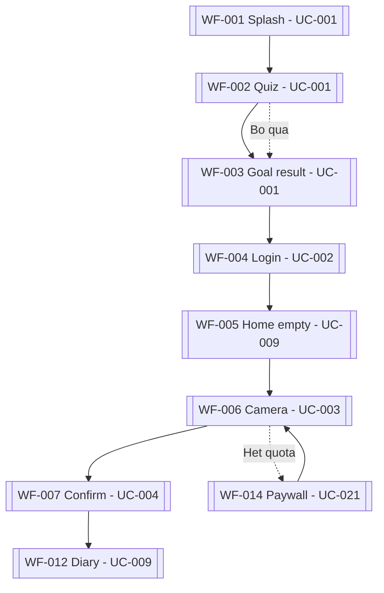

**Steps**:
1. Mở app lần đầu → WF-001 (UC-001) check session, định tuyến user mới sang quiz.
2. Trả lời 6–8 câu hỏi tại WF-002 (UC-001); bỏ qua → goal mặc định (AF-001.1).
3. Xem TDEE + calorie/macro goal tại WF-003 (UC-001), xác nhận để tiếp tục.
4. Đăng nhập Apple/Guest tại WF-004 (UC-002); hủy dialog Apple thì ở lại màn, giữ goal.
5. Vào WF-005 (UC-009) thấy empty state + CTA "Log bữa đầu" (WF-026 inline).
6. Chụp món tại WF-006 (UC-003), AI trả kết quả <5s; hết quota free → rẽ WF-014 (UC-021) rồi quay lại.
7. Sửa khẩu phần và lưu tại WF-007 (UC-004); low-confidence thì bắt chạm đủ items.
8. Kết thúc tại WF-012 (UC-009): ring cập nhật, activation hoàn tất (event log_saved).

**Screens**: WF-001, WF-002, WF-003, WF-004, WF-005, WF-006, WF-007, WF-012, WF-014, WF-026
**Duration**: ~3–5 phút (quiz <90s + scan→lưu <10s + login).

---

### 2.2 Journey 2 — Log hằng ngày của user cũ (retention loop)
**TF**: TF-002, TF-006, TF-007. **UC**: UC-003, UC-004, UC-005, UC-006, UC-007, UC-009, UC-011, UC-012, UC-013, UC-018.

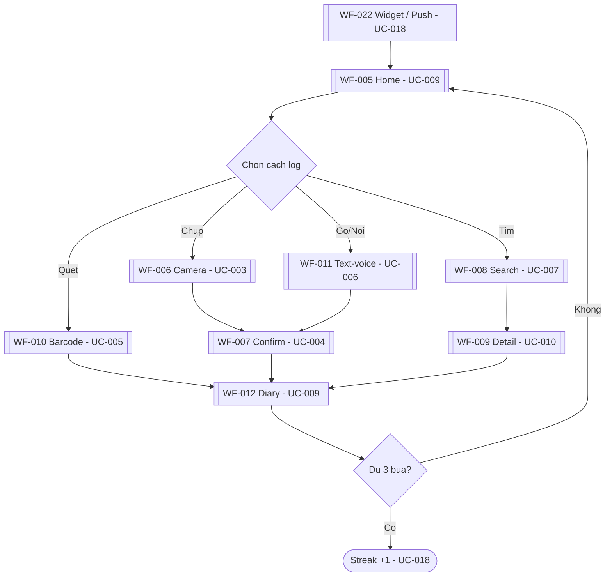

**Steps**:
1. Chạm widget/push nhắc bữa → deep-link vào WF-005 (UC-018, TF-007); tắt push thì badge in-app thay thế.
2. Xem remaining + streak tại WF-005 (UC-009); thiếu bữa → CTA log (rẽ TF-002/TF-006).
3a. Chụp tại WF-006 (UC-003) → xác nhận tại WF-007 (UC-004) → lưu vào WF-012 (UC-009).
3b. Quét mã tại WF-010 (UC-005); miss → tạo custom tại WF-016 (UC-008) → lưu vào WF-012 (UC-009).
3c. Gõ/nói tại WF-011 (UC-006) → parse → xác nhận tại WF-007 (UC-004).
3d. Tìm món Việt tại WF-008 (UC-007), quick add hoặc qua WF-009 (UC-010) rồi lưu vào WF-012 (UC-009).
4. Quản lý trong WF-012 (UC-009/UC-011/UC-012): sửa (WF-009), xóa (WF-023 + Undo 5s), relog món quen, stepper nước (UC-013).
5. Đủ 3 bữa → streak +1 + celebration (UC-018); cuối tuần xem WF-017 (UC-017).

**Screens**: WF-005, WF-006, WF-007, WF-008, WF-009, WF-010, WF-011, WF-012, WF-016, WF-017, WF-022, WF-023, WF-026
**Duration**: mỗi bữa <10s; cả ngày 3–4 sessions vài phút.

---

### 2.3 Journey 3 — Cân nặng tới trend (tiến độ tuần)
**TF**: TF-004. **UC**: UC-015, UC-016, UC-017.

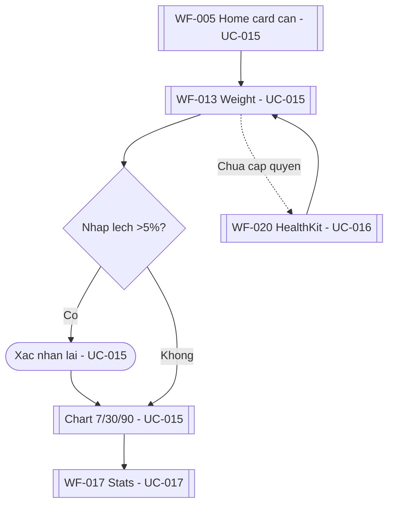

**Steps**:
1. Chạm card cân tại WF-005 (UC-015) hoặc mở tab tiến độ → vào WF-013 (UC-015); điểm mới từ HealthKit tự thêm (UC-016).
2. Nhập cân → lưu <10s tại WF-013 (UC-015); lệch >5% lần trước → cảnh báo xác nhận (AF-015.1).
3. Chuyển tab 7/30/90 ngày, xem delta tuần tại WF-013 (UC-015); <2 điểm → gợi ý cân đều.
4. Chưa cấp quyền HealthKit → rẽ WF-020 (UC-016) xin quyền rồi quay lại; từ chối thì nhập tay đầy đủ.
5. Cuối tuần xem tổng tại WF-017 (UC-017); cân đổi >5% → gợi ý chỉnh goal (WF-015, UC-022).

**Screens**: WF-005, WF-013, WF-017, WF-020, WF-015
**Duration**: <30s cho 1 lần log cân.

---

### 2.4 Journey 4 — Paywall tới trial Pro (monetization)
**TF**: TF-005. **UC**: UC-021, UC-003.

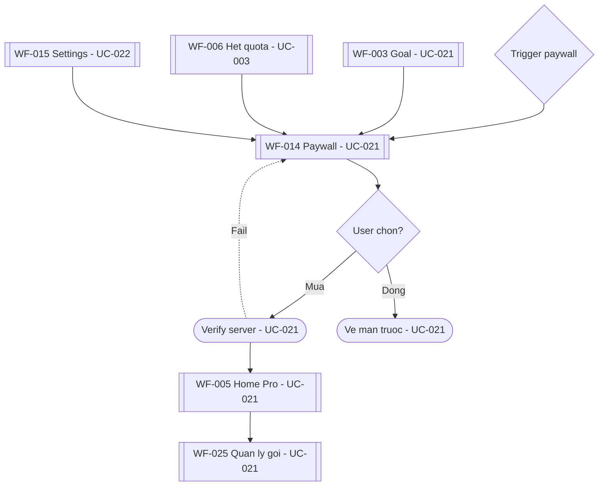

**Steps**:
1. Trigger từ 3 điểm: sau WF-003 (UC-021, user mới), hết 3 scans tại WF-006 (UC-003), hoặc row Pro trong WF-015 (UC-022).
2. Xem giá bill lớn + trial 7 ngày + so sánh free/Pro tại WF-014 (UC-021); giá chưa load → skeleton, CTA disabled.
3. Chọn gói → xác nhận Apple → verify server → mở Pro <5s, unlimited scan tại WF-005 (UC-021).
4. Verify fail → ở lại WF-014 (UC-021), giữ free, nút retry; không trừ quyền cũ.
5. Đóng paywall → về màn trước, nhắc lại tối đa 1 lần/ngày (UC-021).
6. Quản lý/hủy/restore tại WF-025 (UC-021) qua link Apple Subscriptions; đổi máy → Restore <5s.

**Screens**: WF-003, WF-005, WF-006, WF-014, WF-015, WF-025
**Duration**: ~1 phút từ xem giá tới Pro mở.

---

## 3. Screen Navigation Flows

### 3.1 WF-005 Home/Dashboard (UC-009)
**Entry points**: WF-001/WF-004 sau login (UC-002), WF-020 sau cấp quyền (UC-016), tab Home, deep-link từ WF-022 (UC-018).

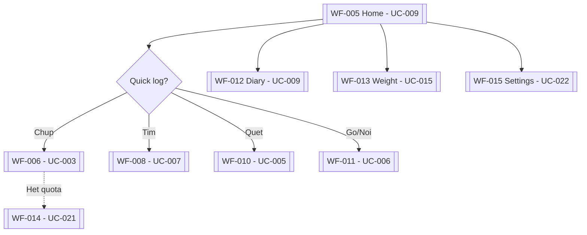

**Steps**:
- Mở app → WF-005 (UC-009): ring consumed/remaining + bữa hôm nay + Health Score render <1s (có cache).
- Chưa log → empty state inline (WF-026, UC-009) + coachmark "Chụp bữa đầu" → WF-006 (UC-003).
- 4 nút quick log → WF-006 (UC-003) / WF-008 (UC-007) / WF-010 (UC-005) / WF-011 (UC-006); hết quota → WF-014 (UC-021).
- Card nước +1 cốc (UC-013), card cân quick-log (UC-015), streak (UC-018) xử lý inline, ở lại màn.
- Pull-to-refresh → sync delta, skeleton ring khi load.
**Exit points**: WF-006/WF-008/WF-010/WF-011 (log), WF-012 (diary chi tiết), WF-013 (cân), WF-015 (settings).

### 3.2 WF-006 Camera scan (UC-003)
**Entry points**: tab Scan, nút + tại WF-005 (UC-009) / WF-012 (UC-009).

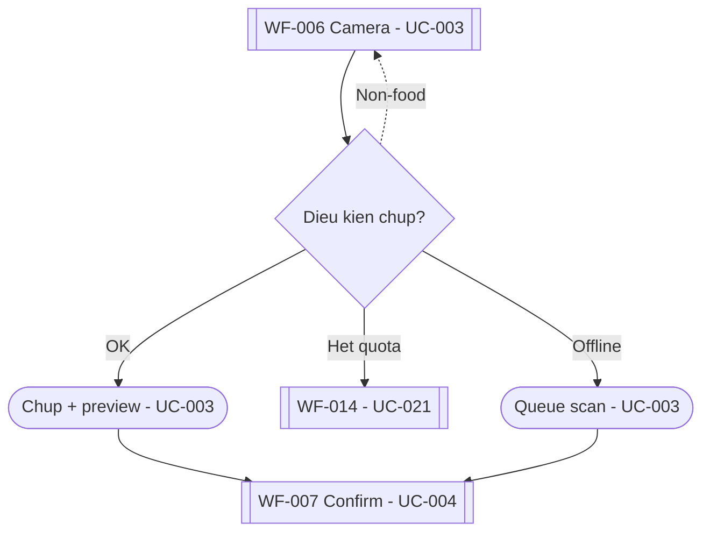

**Steps**:
- Mở WF-006 (UC-003): viewfinder live + quota badge "Còn X scans" + tip chụp (first-time).
- Chụp → preview (Chụp lại / Dùng ảnh) → nén <1MB → upload Edge → sang WF-007 (UC-004).
- Ảnh non-food (Vision pre-filter) → báo + chụp lại, không trừ quota (AF-003.1).
- Offline → queue + gợi ý log tay WF-011 (UC-006); online → BackgroundTask tự phân tích (AF-003.2).
- Hết quota → WF-014 (UC-021), giữ ảnh để scan tiếp sau khi lên Pro.
**Exit points**: WF-007 (dùng ảnh), WF-011 (log tay thay thế), WF-014 (hết quota).

### 3.3 WF-007 AI result confirm (UC-004)
**Entry points**: WF-006 dùng ảnh (UC-003), WF-011 parse xong (UC-006).

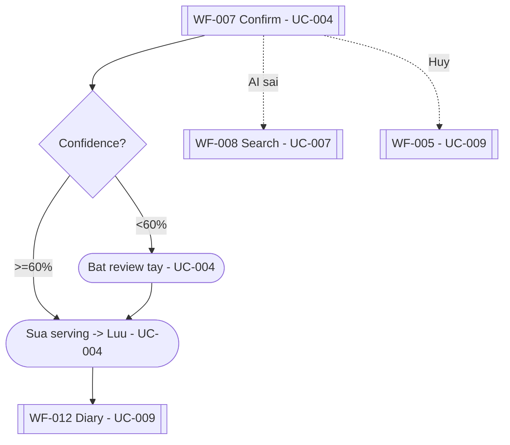

**Steps**:
- Xem items + grams + kcal/P/C/F + confidence badge tại WF-007 (UC-004); skeleton 2–4s khi AI đang chạy.
- Chọn ít/vừa/nhiều hoặc nhập grams → recalc <200ms (SF-001); chọn bữa → Lưu (§3.5.1, §3.5.2).
- Confidence <60% → banner vàng + CTA Lưu disabled tới khi chạm đủ items (AF-004.1).
- Báo "AI sai món" → WF-008 (UC-007) giữ nguyên ảnh để log tay (AF-004.2).
- Lưu xong → toast + về WF-005/WF-012 (UC-009), ring cập nhật, event log_saved.
**Exit points**: WF-005/WF-012 (lưu), WF-008 (thêm món/sửa sai), WF-006 (chụp lại), hủy → màn trước.

### 3.4 WF-012 Diary (UC-009, UC-011, UC-012, UC-013, UC-014)
**Entry points**: tab Diary, WF-005 (UC-009), WF-007 sau lưu (UC-004), WF-017 xem ngày cũ (UC-017).

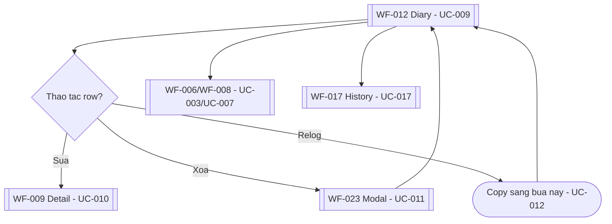

**Steps**:
- Xem tổng ngày + sections Sáng/Trưa/Tối/Snack + Nước + Vận động tại WF-012 (UC-009/UC-013/UC-014).
- Chạm row → WF-009 (UC-010) sửa serving/chuyển bữa; vuốt/nút xóa → WF-023 (UC-011) + Undo toast 5s (SF-002).
- Nút relog ↻ → copy log sang bữa hiện tại (UC-012); món snapshot cũ gắn cờ "giá trị cũ".
- Nút + mỗi bữa → WF-006 (UC-003) / WF-008 (UC-007) gán sẵn bữa.
- Ngày cũ → banner "Chỉ xem" + nút relog sang hôm nay (Variant B).
**Exit points**: WF-009 (sửa), WF-006/WF-008/WF-011 (thêm), WF-017 (history), ở lại màn sau relog/xóa.

### 3.6 WF-014 Paywall (UC-021)
**Entry points**: sau WF-003/WF-004 onboarding (UC-021), hết quota tại WF-006 (UC-003), WF-015/WF-025 (UC-021/UC-022), stats khóa tại WF-017 (UC-017).

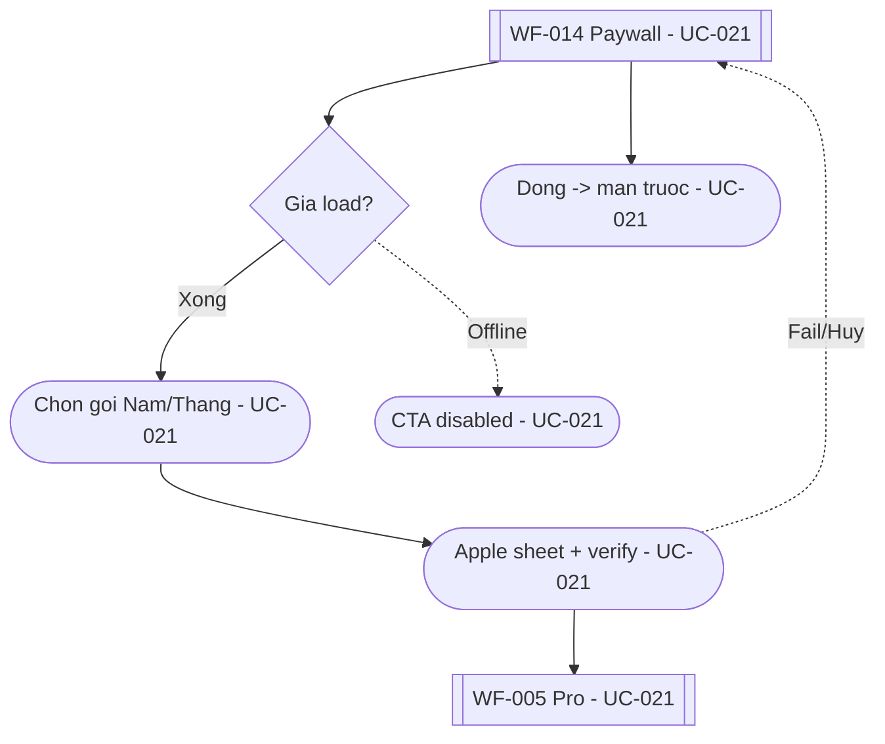

**Steps**:
- Xem headline Pro + giá bill lớn + trial 7 ngày + so sánh free/Pro tại WF-014 (UC-021); gói Năm preselect.
- Hết quota trigger → thêm dòng "Đã dùng 3/3 scans hôm nay" (Variant B).
- Mua → Apple sheet → verify server → dismiss + toast Pro → WF-005 unlimited scan (UC-021).
- Fail/hủy → ở lại màn, lỗi cụ thể; offline → CTA disabled + "Cần mạng để mua".
**Exit points**: WF-005 (mua xong), màn trước (đóng), WF-025 (quản lý gói).

### 3.7 WF-013 Weight trend (UC-015)
**Entry points**: card cân tại WF-005 (UC-015), tab tiến độ, nhắc cân hằng tuần (UC-018).

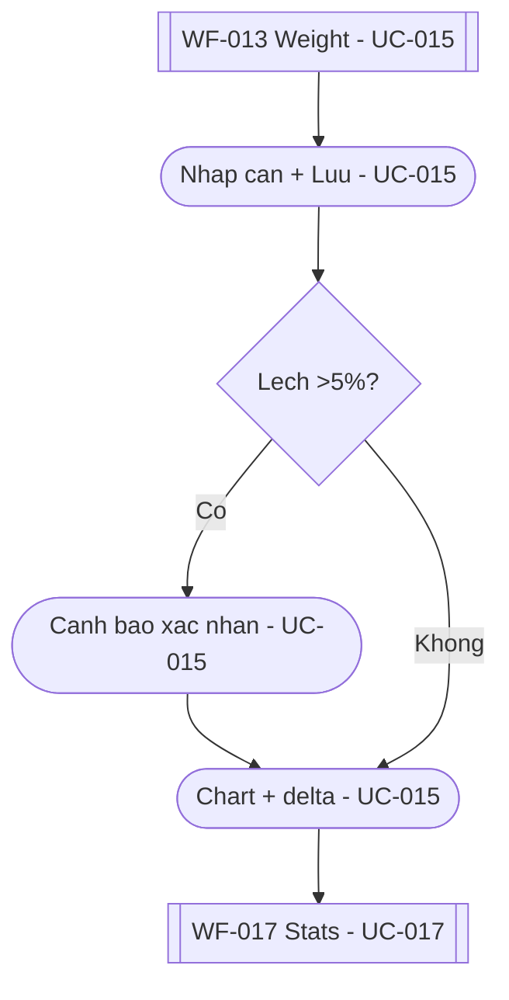

**Steps**:
- Nhập cân bằng stepper ±0.1kg → Lưu <10s tại WF-013 (UC-015); ở lại màn + toast.
- Lệch >5% → cảnh báo "Nhập nhầm?" trước khi lưu (AF-015.1); <2 điểm → gợi ý cân đều.
- Chuyển tab 7/30/90 → chart render <1s; điểm HealthKit gắn badge nguồn (UC-016).
- Xóa điểm sai (qua xác nhận kiểu WF-023) → chart tính lại.
**Exit points**: ở lại WF-013, WF-017 (stats tổng), WF-015 (đổi đơn vị kg/lb).

---

## 3.5 UX Enhancement Flows

### 3.5.1 Confidence badge (WF-007, UC-004)
1. Trigger: AI trả items kèm confidence từng món.
2. User đọc badge 3 mức: xanh ≥80%, vàng 60–79%, đỏ <60% (icon + % + chữ, không chỉ màu).
3. Low (<60%) → banner "AI chưa chắc — kiểm tra grams giúp mình", CTA Lưu disabled.
4. Resolution: user chạm đủ items (đánh dấu đã review) → CTA mở → lưu; VoiceOver đọc "độ chắc chắn 82 phần trăm".

### 3.5.2 Ba mức khẩu phần ít/vừa/nhiều (WF-007, UC-004)
1. Trigger: vào màn xác nhận, mặc định chọn "vừa" (first-time) hoặc serving lần trước của món quen.
2. User chạm segment hoặc nhập grams tay → kcal/macro recalc <200ms, số crossfade 0.2s.
3. Nhập vô lý (>2000g) → chặn + gợi ý khoảng; xóa hết items → CTA disabled + gợi ý thêm món.
4. Resolution: Lưu với serving đã chọn; undo 5s sau lưu.

### 3.5.3 Celebration + streak (WF-005/WF-012, UC-009/UC-018)
1. Trigger: log_saved khiến consumed chạm goal ngày, hoặc đủ 3 bữa.
2. System: confetti nhẹ + streak +1 + toast; tôn trọng Reduce Motion (tắt confetti, giữ fade).
3. Vượt goal → ring đỏ + số âm, thông điệp động viên, không chặn log thêm (AF-009.2).
4. Resolution: streak hiển thị tại WF-005 và WF-017; mất 1 ngày → reset + giữ best streak.

### 3.5.4 Empty states (WF-026 inline, UC-009/UC-017)
1. Trigger: diary ngày mới / history user mới / search 0 kết quả / chưa cân lần nào.
2. Mỗi empty có đúng 1 CTA ngữ cảnh: Chụp bữa đầu → WF-006 (UC-003); tạo custom → WF-016 (UC-008); log cân → WF-013 (UC-015); mở khóa stats → WF-014 (UC-021).
3. Offline + không cache → text offline + CTA log tay WF-011 (UC-006).
4. Resolution: sau khi tạo dữ liệu đầu tiên, empty biến mất vĩnh viễn cho ngữ cảnh đó.

---

## 4. Navigation Patterns

### 4.1 Tab Navigation
4 tabs chuẩn (WF-005 Home, Scan → WF-006, WF-012 Diary, WF-015 Profile); badge streak ở Home, badge quota ở Scan. Tiến độ: WF-013/ WF-017 mở từ Home card hoặc tab More; WF-018/ WF-019 (UC-019/UC-020) thuộc tab More.

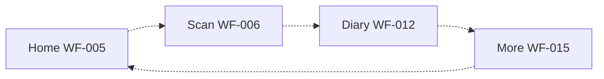

### 4.2 Modal Presentation
Sheet/modal dùng cho: WF-006→WF-007 (scan full-screen), WF-014 paywall, WF-020/WF-021 pre-permission sheets, WF-023 delete confirm (bottom sheet khi context dài), bottom sheet kết quả WF-010. Quy tắc: Hủy luôn rõ, vuốt đóng được, không chặn bằng alert trừ destructive.

### 4.3 Navigation Stack
Drill-down bằng NavigationStack: WF-008 → WF-009 (UC-007→UC-010) → lưu về WF-012; WF-012 → WF-009 → WF-023; WF-015 → WF-025/WF-003 (sửa goal); WF-017 → WF-012 ngày cũ (UC-017→UC-012). Back giữ state list và scroll position.

---

## 5. Error Handling Flows

### 5.1 Network Error Flow
**Áp dụng**: mọi màn có request mạng (WF-005, WF-006, WF-007, WF-010, WF-014, WF-019) — UC-003, UC-021, UC-022. Trigger: mất mạng giữa thao tác → message: banner WF-024 "Offline — dùng số local" (không chặn) → recovery: log tay (WF-011, UC-006) + xem history local; scan vào queue, auto-sync khi online (BackgroundTask); mua Pro thì CTA disabled tới khi có mạng.

### 5.2 Validation Error Flow
**Áp dụng**: form tại WF-002 (UC-001) và WF-016 (UC-008). Trigger: số vô lý (cao/cân ngoài khoảng sinh lý, kcal âm/thiếu tên) → message: hint đỏ inline <0.5s → recovery: CTA disabled tới khi sửa đúng; WF-016 thiếu kcal cho lưu cờ unverified hiển thị dạng khoảng (AF-008.1).

### 5.3 AI confidence thấp
Trigger: confidence <60% tại WF-007 (UC-004) → message: banner vàng "AI chưa chắc" → recovery: bắt review tay từng item rồi mới lưu; AI sai hẳn → WF-008 giữ ảnh log tay; timeout >15s → retry giữ ảnh, không trừ quota.

### 5.4 Barcode không tìm thấy
Trigger: mã vắng ở cả DB nội bộ + Nutritionix tại WF-010 (UC-005) → message: sheet "Không tìm thấy mã" → recovery: CTA tạo custom giữ sẵn mã (WF-016, UC-008); camera bị từ chối → hướng dẫn mở Settings iOS + nhập mã tay.

### 5.5 HealthKit bị từ chối
Trigger: deny toàn phần/bán phần tại WF-020 (UC-016) → message: tip bật lại ở Settings, badge "Thiếu quyền" tại WF-015 → recovery: nhập tay steps/cân đầy đủ (UC-014/UC-015), không chặn flow nào; nhắc lại 1 lần sau 7 ngày; thu hồi giữa chừng → tự chuyển nhập tay + nút sync thủ công.

### 5.6 StoreKit thất bại
Trigger: verify server fail / user hủy Apple sheet tại WF-014 (UC-021) → message: lỗi cụ thể ("Không trừ tiền nếu hủy"), giữ free → recovery: nút retry verify; đổi máy → Restore tại WF-025 <5s; hủy giữa trial vẫn dùng Pro hết trial.

---

## 6. Loading States

### 6.1 Initial Load
WF-001 splash <1.5s cold start (iPhone 12); WF-005/WF-012 render <1s khi có cache; timeout check session 3s rồi vào local mode.

### 6.2 Pull to Refresh
WF-005 (UC-009) và WF-012: kéo → sync delta → ring/list cập nhật; fail → banner retry, giữ số local.

### 6.3 Skeleton Loading
Skeleton khớp layout thật (tránh nhảy layout): ring tại WF-005, items 2–4s tại WF-007 (scan progress "Đang phân tích…", p95 <5s trên 4G), 3 rows tại WF-008, chart tại WF-013/WF-017, 2 plan cards tại WF-014 khi StoreKit pending.

---

## 7. Offline Support

### 7.1 Offline Mode Flow
1. Phát hiện rớt mạng → banner WF-024 (UC-022) trên mọi màn list, không chặn nội dung.
2. Log tay + xem history đầy đủ từ SwiftData local (UC-022, AF-022); search local vẫn đủ (UC-007).
3. Ảnh scan vào queue (AF-003.2), xóa offline xóa local ngay + queue sync delete (AF-011.2).
4. Online trở lại → "Đang đồng bộ…" → toast xong + ẩn banner; conflict last-write-wins theo updated_at, giữ note bản local.

---

## 8. Accessibility Flows

### 8.1 VoiceOver Navigation
Thứ tự đọc: nav → hero số → actions → list. WF-005 ring đọc "Đã nạp X trên Y kilocalo, còn Z" (UC-009, AC-009.5); WF-007 badge đọc %; WF-009/WF-012 rows đọc tên + grams + kcal + nút sửa/xóa; modal WF-023 focus tiêu đề + nút Hủy trước; chart WF-013/WF-017 có mô tả text (delta tuần, trung bình). Ảnh trang trí ẩn khỏi rotor.
Dynamic Type XXXL: hero xếp dọc, row 2 dòng, CTA đáy 50pt vẫn thấy (QA bắt buộc WF-005/WF-007/WF-012). Tương phản WCAG AA, target chạm ≥44pt, shutter 80pt.

---

## 9. Onboarding & Tutorials

### 9.1 First-Time User Experience
Chuỗi WF-001 → WF-002 → WF-003 → WF-004 (UC-001/UC-002, TF-001): quiz <90s, goal có giải thích, login ghi rõ giới hạn Guest. Sau login: pre-permission WF-020 (UC-016) rồi WF-021 xin push sau log bữa đầu (UC-018). TipKit coachmarks: "Chụp bữa đầu" tại WF-005 empty, tip chụp top-down tại WF-006, tooltip sửa grams tại WF-007, giải thích quota 3 scans/ngày. Bỏ qua ở mọi bước đều an toàn (goal mặc định, skip permission không chặn app).

---

## 10. Performance Considerations

### 10.1 Optimistic UI Updates
Stepper nước/cân/serving cập nhật số ngay (<200ms) rồi mới sync; fail → revert + toast retry. Xóa log ẩn row ngay + Undo 5s (UC-011). Relog hiện row mới <1s (UC-012).
Targets từ PRD §9: cold launch <1.5s; render có cache <1s; scan p95 <5s (4G); search <500ms; purchase mở Pro <5s; crash-free ≥99.5%. Nặng (AI, sync, export CSV) chạy background, không block UI.

---

## 11. Flow Summary

### 11.1 Critical Paths

| Flow | Screens | TF | Priority |
|------|---------|----|----------|
| Người mới → bữa đầu | WF-001 → WF-002 → WF-003 → WF-004 → WF-005 → WF-006 → WF-007 → WF-012 | TF-001 | High |
| Chụp → lưu bữa | WF-005 → WF-006 → WF-007 → WF-012 | TF-002 | High |
| Paywall → trial Pro | WF-006/WF-003 → WF-014 → WF-005 | TF-005 | High |
| Log hằng ngày + streak | WF-022 → WF-005 → WF-012 → WF-017 | TF-007 | High |
| Cân → trend | WF-005 → WF-013 → WF-017 | TF-004 | Medium |
| Log thay thế (barcode/text/search) | WF-010/WF-011/WF-008 → WF-007/WF-009 → WF-012 | TF-003/TF-006 | Medium |

### 11.2 Screen Coverage

| Screen | Flows | Critical |
|--------|-------|----------|
| WF-001 Splash | J1, §9.1 | Yes |
| WF-002 Quiz | J1, §5.2, §9.1 | Yes |
| WF-003 Goal | J1, J4, §9.1 | Yes |
| WF-004 Login | J1, §9.1 | Yes |
| WF-005 Home | J1–J4, §3.1, §3.5.3 | Yes |
| WF-006 Camera | J1, J2, J4, §3.2 | Yes |
| WF-007 Confirm | J1, J2, §3.3, §3.5.1, §3.5.2 | Yes |
| WF-008 Search | J2, §3.3–3.4, §3.5.4 | Yes |
| WF-009 Detail | J2, §3.4 | Yes |
| WF-010 Barcode | J2, §3.1, §5.4 | Yes |
| WF-011 Text/voice | J2, §3.1–3.3, §5.1, §7.1 | Yes |
| WF-012 Diary | J1, J2, §3.4, §3.5.3 | Yes |
| WF-013 Weight | J3, §3.6, §6.3 | Yes |
| WF-014 Paywall | J2, J4, §3.2, §3.5 | Yes |
| WF-015 Settings | J3, J4, §3.1, §5.5 | No |
| WF-016 Custom | J2, §3.5.4, §5.2 | No |
| WF-017 History | J2, J3, §3.4, §3.6 | No |
| WF-018 Fasting | §4.1 (tab More) | No |
| WF-019 Coach | §4.1 (tab More), §5.1 | No |
| WF-020 HealthKit | J3, §3.1, §5.5, §9.1 | No |
| WF-021 Push | J2, §9.1 | No |
| WF-022 Widget | J2, §3.1 | No |
| WF-023 Delete modal | J2, §3.4, §4.2 | Yes |
| WF-024 Error/offline | §5.1, §7.1 | Yes |
| WF-025 Subscription | J4, §3.5, §5.6 | No |
| WF-026 Empty | J1, J2, §3.1, §3.5.4 | Yes |

**Coverage**: 26/26 màn hình có mặt trong ít nhất 1 flow. Pass.

---

## 12. Future Enhancements

### 12.1 Planned Flows
- Meal plan AI theo tuần + grocery list: mở rộng từ WF-012/WF-019 (UC-020) sau khi retention + trial-to-paid đạt ngưỡng PRD.
- Apple Watch companion: quick-log + ring glance, đồng bộ 2 chiều với WF-005/WF-013.
- Social/groups, family plan: chỉ sau P2, cân nhắc privacy (ngoài scope PRD §6).
- CloudKit private sync optional, đa ngôn ngữ ngoài Việt + Anh.

---

**Document Version**: 1.0
**Last Updated**: 2026-09-28
**Status**: Draft
**Dependencies**: PRD.md, Project_Overview.md, Use_Cases.md, Wireframes.md
